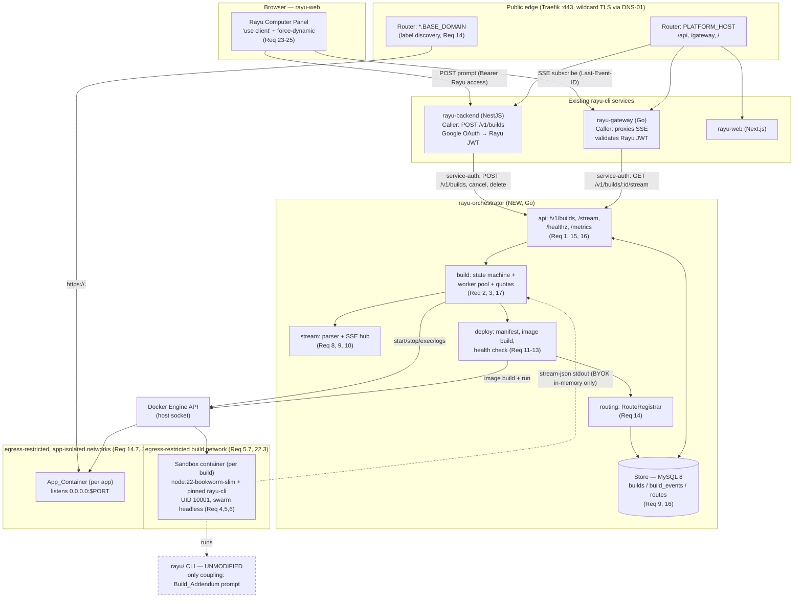
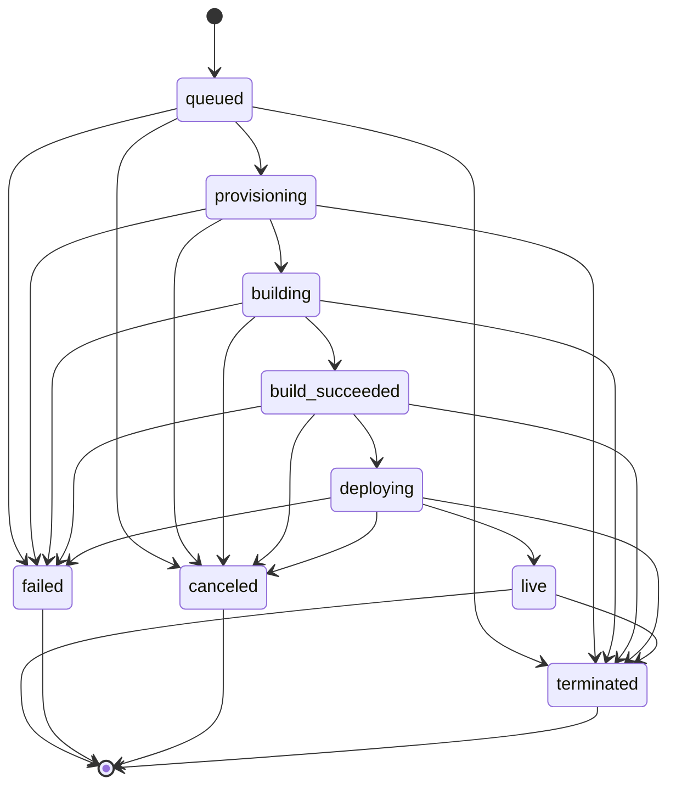

# Design Document — Rayu Computer

## Overview

Rayu Computer turns a single natural-language prompt typed in the `rayu-web` chat ("build a booking system for Cambodia") into a real, deployed, full-stack web application served at `https://<Build_Id>.<Base_Domain>`. It introduces exactly one new standalone service — the **`rayu-orchestrator`** — to the existing `rayu-cli` monorepo, plus a **"Rayu Computer" panel** in `rayu-web`. No code in `rayu/` (the CLI) is modified; the only rayu-side coupling is the runtime **Build_Addendum** prompt fragment handed to the CLI at invocation time.

The orchestrator is a Docker control-plane. For each build it:

1. accepts an authenticated `POST /v1/builds` from `rayu-backend` (the Caller), creating a `queued` Build (Req 1);
2. admits the build under global and per-user limits (Req 3, 17), then starts a hardened, egress-restricted **Sandbox** container that runs the rayu-cli **collaborator swarm** headlessly with `--dangerously-skip-permissions` (Req 4, 5, 6);
3. parses the swarm's `stream-json` stdout into a normalized **Progress_Event** model, persists each event append-only with a gap-free per-build **Sequence_Number**, and streams it live over **SSE** (resumable via `Last-Event-ID`) — proxied to the browser through `rayu-gateway` (Req 8, 9, 10);
4. on success, validates the workspace, builds the generated app's image **on the host**, runs it as its own constrained **App_Container**, health-checks it, registers a wildcard-subdomain route, and marks the build `live` (Req 7, 11, 12, 13, 14);
5. reaps idle apps, cleans up sandboxes/workspaces, garbage-collects orphans, and exposes structured logs + Prometheus metrics (Req 19, 20, 21);
6. protects the End_User's **BYOK** key (memory-only, centrally redacted) and enforces the full security model for executing untrusted AI-generated code (Req 18, 22).

This document resolves the three technology decisions the requirements deliberately left open (orchestrator language, reverse-proxy engine, durable store) in the **Key Design Decisions** section below, then specifies the architecture, components, data models, correctness properties, error handling, and testing strategy. Every subsection is traced to requirement numbers.

### Scope boundary (unchanged from requirements)

In scope: the `rayu-orchestrator`, the sandbox/app/proxy/network runtime, and the `rayu-web` panel. **Explicitly out of scope (deferred non-goals):** billing/metering/payments, horizontal scaling beyond one VPS (no external Redis/NATS build queue — an in-process worker pool is used), custom user domains, long-term persistence/editing/resume of generated projects, a full in-browser IDE, and the internal mechanics of `rayu-backend`/`rayu-gateway` beyond the integration contract. These MUST NOT be assumed present.

---

## Key Design Decisions

The requirements are technology-neutral on three points. Each is resolved below with a recommendation grounded in the existing `rayu-cli` stack, and each is designed behind an abstraction seam so it can be overridden at design review without changing the acceptance behavior.

### Decision 1 — Orchestrator language: **Go** (recommended)

**Recommendation: implement `rayu-orchestrator` in Go.**

| Factor | Go | Node/Bun |
|---|---|---|
| Operational fit | Team already runs Go in `rayu-gateway` (same Dockerfile style, CI, deploy patterns) | Shares language with `rayu`/rayu-cli, but the orchestrator never imports rayu code |
| Docker control-plane | First-class official SDK `github.com/docker/docker/client` (containers, image build, exec, log streaming, networks) | `dockerode` is third-party; streaming/exec ergonomics weaker |
| Concurrency | Goroutines + channels + `context.Context` map directly onto the worker pool, per-build SSE fan-out, heartbeat tickers, and background reaper/GC loops | Single-threaded event loop; workable but less natural for the fan-out + cancellation graph |
| Footprint | Static single binary, small image, low RSS — good for a shared single VPS | Larger runtime footprint |

The orchestrator's job is overwhelmingly Docker orchestration and concurrent stream fan-out, not CLI logic. The only rayu coupling is a text prompt, so the "share a language with rayu-cli" benefit is marginal. Go matches the team's existing operational surface (`rayu-gateway`) and has the strongest Docker client. **This is the primary recommendation; if the team prefers a single JS toolchain, Node/Bun with `dockerode` satisfies every acceptance criterion — no requirement depends on the language.**

**Module layout** (mirrors `rayu-gateway`'s `cmd/ + internal/` convention):

```
rayu-orchestrator/
  cmd/orchestrator/main.go          # wire config → store → docker client → pool → http server
  internal/
    api/        # chi router, service-auth + per-user authz middleware, rate limit, handlers, SSE endpoint, /healthz, /metrics
    build/      # lifecycle state machine, worker pool, admission control + quotas, restart reconciliation
    sandbox/    # SandboxRunner: image run policy, Start/Stream/Wait/Stop/Cleanup
    stream/     # ProgressEvent model, stream-json parser+mapper, SSE hub (replay→live, heartbeat), sequence assignment
    deploy/     # manifest parse/serialize, host image build, App_Container run, health-check poll
    routing/    # RouteRegistrar (Traefik labels; Caddy-Admin fallback), Route_Record lifecycle
    tenancy/    # quota accounting, BYOK key vault (in-memory), central redaction
    store/      # Store interface; InMemoryStore + MySQLStore; builds/build_events/routes
    config/     # env config load + validation
    obs/        # structured logger (redaction hook) + Prometheus registry
```

### Decision 2 — Reverse-proxy engine: **Traefik at the edge** (recommended), Caddy routes folded in; `RouteRegistrar` seam preserves an override

**Recommendation: adopt Traefik as the single public edge proxy on `:80/:443`, folding the three existing Caddy platform routes into Traefik static routers, and let Traefik's Docker provider auto-discover per-app containers by label.**

Requirement 14 needs: wildcard subdomain routing to per-app containers, automatic wildcard TLS via DNS-01, **container-runtime (label) discovery**, per-app network isolation, and 404 for unmapped hosts. The requirement wording ("discover App_Containers through the container runtime provider", "labels declare that host", and Req 14.1 "attach Reverse_Proxy routing labels") describes Traefik's Docker-provider model almost verbatim.

| Factor | Traefik (recommended) | Extend existing Caddy |
|---|---|---|
| Dynamic per-app routes | Native Docker-label discovery; route appears when the labeled App_Container starts and **disappears automatically when it stops** (perfect for reap/GC/cancel teardown — Req 14, 19, 20) | No native label discovery; orchestrator must drive the Caddy **Admin API** to PATCH/DELETE routes on every live/stop, plus reconcile on restart |
| Wildcard TLS via DNS-01 | DNS providers built in; one `certificatesResolver` covers `*.<Base_Domain>` | Requires a custom Caddy image built with the DNS plugin (`xcaddy`) |
| 404 for unmapped host | Default behavior | Must be configured explicitly |
| Ops cost | One more component, but **single edge** (no `:443` contention) | Reuses an in-stack component, but adds Admin-API integration + reconciliation code |

The decisive factor is **automatic route teardown**: because Traefik derives routes purely from live container labels, stopping an App_Container (idle reap, cancel, delete, orphan GC) removes its route with zero extra orchestrator action — eliminating a whole class of route-leak/`404`-correctness bugs. Running two proxies that both want `:443` on one VPS is the real operational problem, so Traefik **replaces** Caddy at the edge rather than running beside it. Migration cost is low: today's `Caddyfile` is only three path routes, translated to three Traefik routers:

- `Host(`{$PLATFORM_HOST}`) && PathPrefix(`/api`)` → `backend:4000`
- `Host(`{$PLATFORM_HOST}`) && PathPrefix(`/gateway`)` → `gateway:8080` (StripPrefix; streaming — see below)
- `Host(`{$PLATFORM_HOST}`)` → `web:3000`
- `HostRegexp(`{subdomain:[a-z0-9-]+}.{$BASE_DOMAIN}`)` → discovered App_Containers by label

SSE is preserved: Caddy used `flush_interval -1`; Traefik does not buffer `text/event-stream` responses (immediate flush), so both the `/gateway` proxy and the orchestrator stream remain real-time.

**Override seam.** All proxy coupling lives behind a `RouteRegistrar` interface (see Components). The Traefik implementation only sets labels at container-create time and writes the Route_Record; a `CaddyAdminRegistrar` implementation (PATCH/DELETE the Caddy Admin API) is the drop-in fallback if the team prefers to keep Caddy as the edge. Either way the orchestrator's observable behavior (Req 14.1, 14.5 Route_Record creation; 14.6 404; teardown on stop) is identical.

### Decision 3 — Durable store: **reuse the existing MySQL 8** (recommended), app-level gap-free sequence; `Store` interface keeps Postgres/in-memory swappable

**Recommendation: persist `builds`, `build_events`, and `routes` in the existing MySQL 8 instance (a dedicated `orchestrator` database/schema), not a new Postgres.**

Requirements 9 and 16 require durable, append-only, gap-free per-build event persistence (sequence starts at 1, monotonic, no gaps/dups) plus ownership records.

| Factor | Reuse MySQL 8 (recommended) | Stand up Postgres |
|---|---|---|
| Engine count on the VPS | One engine platform-wide (`rayu-backend` + `rayu-gateway` already on MySQL 8) — one backup, one credential, one thing to monitor | Second engine to operate/back up/monitor |
| Gap-free per-build sequence | **App-level** allocation (identical work in either engine) | **App-level** allocation (same) |
| Plan alignment | Diverges from plan's Postgres assumption | Matches plan |

The "Postgres has better sequence ergonomics" argument does **not** apply here: neither Postgres sequences nor MySQL `AUTO_INCREMENT` produce a **per-build, gap-free** counter — both are global and skip values on rollback. A gap-free per-partition counter must be allocated by the application transactionally in either engine, so Postgres offers no functional advantage for this requirement, while MySQL preserves the platform's existing "one database engine" property. MySQL 8 / InnoDB provides everything needed: transactions, `SELECT ... FOR UPDATE` row locks, composite primary keys, and `REPEATABLE READ`.

**Gap-free sequence allocation strategy (engine-agnostic; implemented on MySQL 8).** Each Build_Record carries a `next_seq` counter column (initialized to 1). Appending an event runs in a single transaction:

```sql
START TRANSACTION;
SELECT next_seq FROM builds WHERE id = ? FOR UPDATE;     -- lock the build row, read N
INSERT INTO build_events (build_id, seq, kind, payload, created_at)
  VALUES (?, N, ?, ?, NOW(6));                            -- PK (build_id, seq) rejects dups
UPDATE builds SET next_seq = N + 1, updated_at = NOW(6) WHERE id = ?;
COMMIT;                                                    -- rollback burns no number
```

The composite PK `(build_id, seq)` guarantees no duplicate; the `FOR UPDATE` lock serializes writers for one build so no number is skipped or reused; and because the counter increment and the insert commit/rollback together, an aborted append never "burns" a sequence value (no gaps). In practice all events for a build are produced by that build's single owning worker goroutine, so the row lock is essentially uncontended and serves as a correctness backstop rather than a hot path.

**Reversibility.** Persistence is accessed only through a `Store` interface with three implementations: `InMemoryStore` (the requirements-permitted first increment + the substrate for property tests), `MySQLStore` (production, recommended), and an optional `PostgresStore` (if the team overrides this decision). The schema and the allocation logic are identical across SQL engines.

---

## Architecture

### System context



**Boundaries.** The browser only talks to `rayu-backend` (build creation/cancel via `NEXT_PUBLIC_RAYU_API_URL`) and `rayu-gateway` (SSE via `NEXT_PUBLIC_RAYU_GATEWAY_URL`); it never reaches the orchestrator directly. The orchestrator only talks to authenticated Callers, the Docker Engine API, and its Store. `rayu/` is consumed only as a pinned binary inside the Sandbox, parameterized by the Build_Addendum — no source change (Req boundary).

### End-to-end request path (Req 1, 10, 23–25)

```mermaid
sequenceDiagram
  participant U as End_User (browser, Panel)
  participant B as rayu-backend (Caller)
  participant O as rayu-orchestrator
  participant G as rayu-gateway (Caller)
  participant S as Sandbox (rayu-cli swarm)
  participant P as Reverse proxy + App_Container

  U->>B: POST build {prompt, [BYOK]} (Bearer Rayu access)
  B->>O: POST /v1/builds {prompt, ownerId, [byok]} (service-auth)
  O-->>B: 201 {buildId, status:queued, streamUrl}
  B-->>U: {buildId, streamUrl}
  U->>G: GET /v1/builds/{id}/stream (Last-Event-ID?)
  G->>O: GET /v1/builds/{id}/stream (service-auth, ownerId)
  O-->>G: 200 text/event-stream (replay→live, id:=seq, 15s heartbeat)
  G-->>U: SSE events
  O->>S: start hardened sandbox; run swarm headless
  S-->>O: stream-json stdout → ProgressEvents (persist seq, fan-out SSE)
  O->>P: build image, run App_Container, health-check, register route
  O-->>G: status:live + deploy event {https://<id>.<base>}
  G-->>U: live link; stream closes on terminal
```

### Networks (Req 5.7, 12.4, 14.7, 22.2–22.4)

- `egress` (build network): sandboxes attach here; an egress firewall (sidecar/iptables policy on the network) permits outbound only to configured AI-provider endpoints and package registries, denying all else **including link-local `169.254.0.0/16` and cloud metadata `169.254.169.254`**. Internal traffic between sandboxes is disabled (`enable_icc=false` / per-build network).
- `proxy` network: shared only between Traefik and each App_Container so Traefik can reach the app's internal port. App_Containers are placed on **per-app** networks (or ICC-disabled) so no App_Container can initiate a connection to another App_Container or to a Sandbox.
- App_Containers also attach to an egress-restricted network denying link-local/metadata (Req 12.4).

---

## Components and Interfaces

Interfaces are expressed in Go-flavored pseudocode (Decision 1). Each maps to a requirement set.

### 1. HTTP API (`internal/api`) — Req 1, 15, 16, 21

Router (chi) with middleware order: `recover → request-log → rate-limit (Req 15.4) → service-auth (Req 15.1–15.3) → per-user-authz (Req 16) → handler`. `GET /healthz` and `GET /metrics` bypass the auth/authz/rate-limit chain (Req 15.3).

```
POST   /v1/builds                  # Req 1.1/1.2, 17.2/17.4 — create build
GET    /v1/builds/{id}             # Req 1.3, 16.2/16.3 — status (subdomainUrl when live)
GET    /v1/builds/{id}/stream      # Req 10 — SSE, Last-Event-ID
POST   /v1/builds/{id}/cancel      # Req 1.5, 2.5 — cancel (409 if terminal)
DELETE /v1/builds/{id}             # Req 1.6 — terminate + teardown
GET    /healthz                    # Req 1.7 — 200/503 by store+runtime reachability
GET    /metrics                    # Req 1.8, 21.2 — Prometheus text
```

Request/response shapes (all `application/json`, Req 1.9):

```jsonc
// POST /v1/builds  request
{ "prompt": "build a booking system for Cambodia",
  "ownerId": "user_2abc...",            // End_User identity supplied by Caller (Req 16.1)
  "byok": { "baseUrl": "...", "apiKey": "sk-...", "model": "..." } }  // optional; memory-only (Req 18)
// 201 response
{ "buildId": "bld_7f3k2a", "status": "queued",
  "streamUrl": "/v1/builds/bld_7f3k2a/stream",
  "createdAt": "2025-01-01T00:00:00.000Z" }
// 400 (Req 1.2) / 401 (Req 15.2) / 404 (Req 1.4,16.3) / 409 (Req 2.5) / 429 (Req 15.4,17.2,17.4)
{ "error": { "code": "empty_prompt", "message": "prompt must be non-empty" } }

// GET /v1/builds/{id}  → 200
{ "buildId": "bld_7f3k2a", "status": "live",
  "createdAt": "...", "updatedAt": "...",
  "subdomainUrl": "https://bld_7f3k2a.apps.example.com",   // present WHERE status==live (Req 1.3)
  "failureReason": null }
```

**Service authentication (Req 15) — recommendation.** Use a **signed service token (HMAC-SHA256) reusing the shared `RAYU_JWT_SECRET`** that `rayu-backend` and `rayu-gateway` already share, rather than mTLS. Rationale: the secret-sharing trust channel already exists across these services (see RAYU.md cross-service auth), it is zero new PKI to operate on a single VPS, and the gateway already mints/validates Rayu JWTs. The orchestrator validates an `Authorization: Bearer <service-jwt>` whose claims include the Caller identity and a short TTL; the **End_User identity travels in the request body/`ownerId`** (and is itself derived upstream from the Google OAuth → Rayu exchange). mTLS remains a documented alternative if network-level caller authentication is later required. Auth failures → `401` and no side effects (Req 15.2). `GET /healthz`,`/metrics` exempt (Req 15.3).

**Rate limiting (Req 15.4).** Token-bucket per Caller identity; excess → `429`. Distinct from quota `429`s by error code (`rate_limited` vs `quota_exceeded`/`daily_quota_exceeded`).

**Per-user authorization (Req 16).** For `GET/cancel/delete/stream` on a specific build, the handler compares request `ownerId` to `Build_Record.ownerId`. **Non-owner and non-existent are indistinguishable: both return `404`** (Req 16.3), so existence is never disclosed.

### 2. Build lifecycle + worker pool (`internal/build`) — Req 2, 3, 7, 17

**State machine (Req 2).**



```go
type Status string // queued, provisioning, building, build_succeeded, deploying, live, failed, canceled, terminated

// Pure, table-driven (Req 2.2). live→terminated is the only transition out of a terminal-ish "live"
// (live is terminal for forward progress but reapable to terminated, Req 19.3).
func CanTransition(from, to Status) bool
func IsTerminal(s Status) bool   // live, failed, canceled, terminated

// Applies a transition: validates (Req 2.2/2.3), persists Build_Record (Req 2.4),
// emits a `status` ProgressEvent before the next transition (Req 2.4); on `failed`
// records reason + emits `error` event (Req 2.6); rejected transitions retain status
// and emit a `log` event (Req 2.3).
func (m *Machine) Transition(ctx, buildID string, to Status, reason string) error
```

Note on `live`: forward progress ends at `live`; the only edge leaving `live` is `live→terminated` via the Idle_Reaper/delete (Req 19.3, 1.6). `Terminal_Status` for stream-close and cancel-rejection purposes = {`live`,`failed`,`canceled`,`terminated`} (Req 2.5, 10.5).

**Worker pool + admission control (Req 3, 17).**

```go
type Pool struct { maxConcurrent int /* MAX_CONCURRENT_BUILDS */ ; … }
// Admission loop (Req 3.2/3.3/3.4): when a building slot frees, pick the LONGEST-queued build
// whose owner is under PER_USER_CONCURRENCY; transition queued→provisioning. Emit queue-position
// `status` events while queued (Req 3.5).
func (p *Pool) Admit() (*Build, bool)
// Quotas (Req 17): checked at POST time — concurrency (active builds, Req 17.1/17.2) and
// daily (trailing 24h, Req 17.3/17.4) → 429. Active count decremented on terminal (Req 17.5).
func (q *Quota) CheckOnCreate(ownerID string) error
```

A build's lifecycle runs in one owning goroutine driven by a `context.Context`; `cancel()` flips it toward `canceled`. Bounded global concurrency = `maxConcurrent`; the "building" gauge (Req 21.2) reflects active sandboxes.

**Restart reconciliation (Req 2.7).** On startup, load all non-terminal builds; for each, inspect Docker for its Sandbox/App_Container; if absent, transition to `failed` (reason `reconciled_missing_runtime`).

### 3. Sandbox runtime (`internal/sandbox`) — Req 4, 5, 6, 22

**Sandbox_Image (Req 4)** — built and pinned at image-build time, not runtime:

```dockerfile
FROM node:22-bookworm-slim                 # Req 4.1
ARG RAYU_CLI_VERSION                        # exact pin recorded in build config (Req 4.2)
RUN npm i -g @rayu-dev/rayu-cli@${RAYU_CLI_VERSION} \
    || (echo "pinned rayu-cli ${RAYU_CLI_VERSION} not installable" && exit 1)  # Req 4.5
RUN useradd -u 10001 -m sandbox             # non-root UID 10001 (Req 4.3)
COPY entrypoint.sh /usr/local/bin/entry     # Entry_Script entrypoint (Req 4.4)
USER 10001
ENTRYPOINT ["/usr/local/bin/entry"]
```

**Hardened run policy (Req 5, 22).** `SandboxRunner` issues a Docker `ContainerCreate`/`Start` whose `HostConfig` encodes every Req-5 control:

```go
type RunSpec struct {
  Image      string            // SANDBOX_IMAGE
  WorkspaceHostDir string      // bind-mounted writable workspace (Req 5.2)
  Env        map[string]string // includes BYOK + IS_SANDBOX=1 (in-memory only, Req 6.5/18.2)
  Limits     ResourceLimits    // PidsLimit, NanoCPUs, Memory (Req 5.6)
  Network    string            // EGRESS_NETWORK (Req 5.7)
}
// HostConfig mapping (Req 5.1–5.7, 22.1–22.3):
//   CapDrop=["ALL"]; ReadonlyRootfs=true; Tmpfs={"/tmp":"rw,size=64m"}
//   User="10001"; SecurityOpt=["no-new-privileges:true","seccomp=<profile>"]
//   PidsLimit, NanoCPUs, Memory; NetworkMode=EGRESS_NETWORK
//   Binds=[WorkspaceHostDir+":/workspace:rw"]
type SandboxRunner interface {
  Start(ctx, RunSpec) (Handle, error)              // create+start (Req 5)
  Stream(ctx, Handle) (<-chan StdLine, error)      // demux stdout/stderr lines (Req 6.6, 8.7)
  Wait(ctx, Handle) (ExitResult, error)            // OOM-kill ⇒ resource-exhaustion (Req 5.8)
  Stop(ctx, Handle) error                          // on leaving `building` (Req 20.1)
  Cleanup(ctx, Handle) error                       // remove container + workspace on terminal (Req 20.1/20.2)
}
```

**Skip-permissions safety gate (Req 6.8, 22.7).** Confirmed against `rayu/src/setup.ts`: the CLI permits `--dangerously-skip-permissions` only when it detects a sandbox (`IS_SANDBOX=1` / Docker / Bubblewrap), runs **non-root**, and has **no general internet**. The RunSpec satisfies all three: `IS_SANDBOX=1` env + Docker context (detectable), `User=10001` (non-root), and the egress-restricted network (no general internet — only AI/registry endpoints). This is why the hardening is a precondition of auto-approve, not merely defense-in-depth.

### 4. Headless swarm invocation (`Entry_Script` + parser) — Req 6, 8

**Entry_Script** (the Sandbox entrypoint). It receives the prompt and config via env (BYOK in-memory only — Req 6.5/18.2) and drives rayu-cli over `stream-json`:

```bash
# 1) feed two stream-json USER messages on stdin (SDKUserMessage shape confirmed in
#    rayu/src/server/directConnectManager.ts): {type:'user',message:{role:'user',content},...}
#    msg1: "/collaborator_swarm"      (engage the swarm — Req 6.1)
#    msg2: "<End_User prompt>\n\n<Build_Addendum>"   (Req 6.1, 6.4)
# 2) invoke rayu-cli (Req 6.2/6.3):
rayu --print \
     --agent-teams \
     --input-format stream-json --output-format stream-json \
     --verbose \                         # required by stream-json+print (rayu/src/cli/print.ts)
     --dangerously-skip-permissions \
     --model "$BUILD_MODEL" < messages.ndjson \
  | tee /workspace/.rayu-stream.ndjson \  # durable per-build trace (Req 6.6)
  | forward_to_orchestrator               # one line at a time, no buffering beyond a line (Req 6.6)
```

- `--print` SHOULD be present; if only `--print` is missing while all Req-6.2 flags are present, proceed (Req 6.3 — print affects formatting only).
- BYOK provided via env/stream, **never written to a file** in the sandbox (Req 6.5); the addendum and prompt are the only file content.
- On a `result` stream-json message, the Entry_Script reports success/error subtype and treats generation as complete (Req 6.7).

**Build_Addendum text contract (Req 6.4, 7, 11).** Appended to the End_User prompt; instructs the swarm to emit, in the workspace root:
1. a `Dockerfile` that builds and runs the app, and
2. a `rayu-build.json` Build_Manifest: `{ "name": string, "type": "node"|"static", "port": number, "healthCheckPath": string, "env": { … } }`,
with the app configured to **listen on `0.0.0.0:$PORT`** (so the App_Container's internal port is reachable by the proxy). The addendum is the **only** rayu-side coupling.

**Stream-json → Progress_Event mapping (Req 8).** The parser reads NDJSON lines from `Stream()` and maps them. Phase detection keys off the swarm's own coordination artifacts observed in the repo (`.rayu/swarm/shared.json` and per-domain `<DOMAIN>.md` writes):

| stream-json input | Progress_Event `kind` | Carried data | Req |
|---|---|---|---|
| `type:"assistant"` | `log` | assistant text | 8.2 |
| `type:"tool_use"` (tool invocation) | `tool_use` | tool name | 8.3 |
| `type:"tool_result"` | `tool_result` | result summary | 8.4 |
| file write/edit tool (Write/Edit) on workspace path | `file_change` | workspace-relative path | 8.5 |
| swarm phase markers / `.rayu/swarm/shared.json` or `<DOMAIN>.md` write | `phase` | one of `scope`,`plan`,`build`,`review`,`deploy` | 8.1, 24.2 |
| agent/collaborator spawn or `subagent_type` | `agent` | agent/collaborator name | 8.1, 24.2 |
| `type:"result"` | `result` | success/error outcome | 8.6 |
| unparseable stdout line | `log` | raw line (then continue) | 8.7 |
| stderr line / non-zero exit | `error` | message | 7.3, 5.8 |

Every emitted Progress_Event carries `buildId` and the assigned `seq` (Req 8.8).

### 5. Progress streaming, persistence, SSE (`internal/stream`) — Req 8, 9, 10

```go
type ProgressEvent struct {
  BuildID string `json:"buildId"`
  Seq     int64  `json:"seq"`             // gap-free per build (Req 8.8, 9.2)
  Kind    string `json:"kind"`            // status|phase|agent|tool_use|tool_result|file_change|log|deploy|result|error (Req 8.1)
  Payload map[string]any `json:"payload"` // redacted before persist/deliver (Req 18.3)
  Ts      time.Time `json:"ts"`
}

// Emit = redact (Req 18.3) → assign next seq + append to store (Req 9.1) → fan-out to SSE subscribers.
// Persist BEFORE delivery so a crash never delivers an unpersisted event (Req 9.1).
func (h *Hub) Emit(ctx, ev ProgressEvent) error

// SSE handler (Req 10):
//   - Content-Type text/event-stream; id: = seq (Req 10.2)
//   - Last-Event-ID:N ⇒ replay persisted events with seq>N ascending, THEN live (Req 10.3)
//   - no event for 15s ⇒ heartbeat comment ":\n\n" (Req 10.4)
//   - terminal status ⇒ deliver final event, then close (Req 10.5)
//   - already-terminal at connect ⇒ replay all ascending, then close (Req 10.6)
func (h *Hub) ServeSSE(w, r, buildID string, lastEventID int64)
```

The SSE hub keeps an in-memory per-build subscriber set and a "live tail" channel; replay reads from the Store (Req 9.4 ascending). A subscriber that connects mid-build gets `replay(lastEventID) → switch to live` atomically (no gap, no dup — see Correctness Properties).

### 6. Deploy subsystem (`internal/deploy`) — Req 11, 12, 13

```go
type Manifest struct { Name string; Type string; Port int; HealthCheckPath string; Env map[string]string }
func ParseManifest([]byte) (Manifest, error)        // Req 11.1/11.2; invalid ⇒ Req 11.3
func (m Manifest) Canonical() []byte                // stable key order ⇒ round-trip (Req 11.4)

// Deploy pipeline (host-side, NOT docker-in-docker):
//  1) parse+validate manifest (Req 11) — select strategy by type (Req 11.5/11.6)
//  2) docker build image from workspace Dockerfile on the host (Req 12.1); build log → `deploy` events;
//     failure ⇒ failed + deploy event (Req 12.2)
//  3) run App_Container: CPU/mem/pids limits, CapDrop ALL, no-new-privileges, read-only rootfs+tmpfs,
//     egress-restricted network denying link-local/metadata (Req 12.3/12.4)
//  4) emit `deploy` events for build-start, build-done, container-start; coalesce within
//     DEPLOY_COALESCE_INTERVAL (Req 12.5)
//  5) health-check poll GET :Port+HealthCheckPath until 200 or HEALTHCHECK_DEADLINE (Req 13.1):
//       success ⇒ deploying→live + `deploy` event with subdomainUrl (Req 13.2/13.4)
//       deadline ⇒ stop container + failed(health_check_failure) (Req 13.3)
```

**Deploy strategies (Req 11.5):** `static` → static-site strategy (serve built assets); `node` → Node service strategy (run the declared entrypoint). No strategy is applied until the manifest is parsed+validated (Req 11.6).

### 7. Routing (`internal/routing`) — Req 14, 19

```go
type RouteRegistrar interface {
  // Labels set at App_Container create so the proxy discovers host→port (Req 14.1/14.2).
  Labels(buildID string, port int) map[string]string
  // Create Route_Record on live (Req 14.5); teardown on stop/reap/delete (Req 14, 19.3, 20).
  Register(ctx, Route) error
  Deregister(ctx, buildID string) error
}
// Traefik impl (recommended): Labels() returns
//   traefik.enable=true
//   traefik.http.routers.<id>.rule=Host(`<id>.<BASE_DOMAIN>`)
//   traefik.http.routers.<id>.tls=true
//   traefik.http.routers.<id>.tls.certresolver=wildcard
//   traefik.http.services.<id>.loadbalancer.server.port=<port>
// Register/Deregister only write/delete the Route_Record; routing itself follows container lifecycle.
// CaddyAdminRegistrar (fallback): additionally PATCH/DELETE Caddy Admin API routes.
```

- Wildcard TLS via DNS-01 (Req 14.3): one `wildcard` cert resolver for `*.<BASE_DOMAIN>`.
- Env selection (Req 14.4): production uses the configured wildcard `BASE_DOMAIN` with wildcard DNS; development derives `BASE_DOMAIN` from `sslip.io` (e.g. `<vps-ip>.sslip.io`).
- Unmapped host → `404` (Req 14.6) is the proxy default (no Route_Record / no labeled container = no router).
- Per-app network isolation (Req 14.7, 22.4): each App_Container on a per-app/ICC-disabled network; only Traefik shares the `proxy` network with it.
- Last-access (Req 19.1): Traefik access logs are tailed (or the orchestrator updates last-access from proxy access events) to update `routes.last_access_at`.

### 8. Tenancy, BYOK, redaction (`internal/tenancy`, `internal/obs`) — Req 16, 17, 18, 21, 22

```go
// BYOK vault: in-memory map buildID→key; set on create, deleted on terminal (Req 18.1/18.4).
type KeyVault interface { Put(buildID, key string); Get(buildID) (string, bool); Drop(buildID string) }

// Central redaction — the SINGLE choke point all logs + events pass through (Req 18.3/18.5, 21.4, 22.5).
//   Redacts: (a) the active BYOK key for that build EVEN IF no pattern configured (Req 18.3),
//            (b) any substring matching configured SECRET_PATTERNS.
func Redact(buildID, s string) string
```

The logger wraps every entry through `Redact` (Req 21.4); the event serializer redacts every `ProgressEvent.Payload` before persist/deliver (Req 18.3); stream-json lines are redacted **before** mapping to events (Req 18.5). Keys are dropped from memory at terminal (Req 18.4).

### 9. Lifecycle & ops (`internal/build` background loops, `internal/obs`) — Req 19, 20, 21

- **Idle_Reaper (Req 19):** periodic loop over `live` builds; if `now-last_access_at > APP_IDLE_TTL` or `now-created_at > APP_TTL` → stop App_Container, deregister route, `live→terminated` (reason recorded, Req 19.4).
- **Cleanup (Req 20.1/20.2):** stop+remove Sandbox when leaving `building`; remove bind-mounted workspace dir on terminal.
- **Orphan GC (Req 20.3/20.4):** periodic reconcile of Docker containers vs Store; remove containers with **no** corresponding non-terminal Build_Record; never remove a container that still has a non-terminal record (long-running `building` is handled by the build timeout, Req 7.5, not GC). Log removal with container id + reason; complete removal even if the log write fails.
- **Metrics (Req 21.2/21.3):** `builds_total{terminal_status}` counter, `building` gauge, `live` gauge, `build_duration_seconds` histogram (recorded on terminal; may record on cancel/interrupt when a meaningful duration exists).
- **/healthz (Req 1.7):** 200 iff Store and Docker reachable, else 503.

### 10. `rayu-web` "Rayu Computer" panel — Req 23, 24, 25

A client component following the repo's confirmed conventions (`'use client'` on line 1; `export const dynamic = 'force-dynamic'`; `apiUrl()` from `lib/config.ts`; Rayu access token obtained via `useRayuToken()` from `lib/useRayuToken.ts`, which exchanges the NextAuth Google ID token for a Rayu session and persists it in `localStorage` with silent refresh).

- **Submission (Req 23):** Auth-gated (sign-in prompt while unauthenticated, no submit — Req 23.2); validate non-empty/non-whitespace prompt client-side (Req 23.4); obtain Rayu access token via `useRayuToken()` and `POST` to `NEXT_PUBLIC_RAYU_API_URL` with Bearer (Req 23.3); on 201 switch to live-progress view (Req 23.5); 429 → quota message + retry (Req 23.6); other errors → message + re-enable (Req 23.7). Optional BYOK is **never** persisted in browser storage and only sent over the authenticated HTTPS request (Req 23.8).
- **Live progress + resume (Req 24):** open `EventSource`/`fetch` SSE to `NEXT_PUBLIC_RAYU_GATEWAY_URL` (Req 24.1); render by `kind` (phase/agent/tool_use/tool_result/file_change/log — Req 24.2); update status on `status` events (Req 24.3); retain last rendered `seq` (Req 24.4); on drop before terminal, reconnect with `Last-Event-ID = lastSeq` (Req 24.5); cancel control posts cancel to backend (Req 24.6); show "still connected, awaiting progress" when idle (Req 24.7).
- **Completion/failure (Req 25):** on `live`, render `https://<id>.<base>` as an open-in-new-context control (Req 25.1); on `failed`, show the terminal `error` reason (Req 25.2); on `canceled`, indicate cancellation (Req 25.3); on any terminal, close SSE + re-enable starting a new build (Req 25.4); opening a panel for an already-terminal build requests the stream with no `Last-Event-ID`, renders replay in seq order, and shows the terminal outcome (Req 25.5).

### Configuration & environment (Req 5, 10, 14, 17, 19) — orchestrator keys

| Key | Purpose | Req |
|---|---|---|
| `BASE_DOMAIN` | wildcard app domain (prod) / sslip.io (dev) | 14.4 |
| `PLATFORM_HOST` | existing platform host for Traefik static routers | 14 |
| `DOCKER_HOST` | Docker Engine API endpoint (host socket) | 5,12 |
| `BUILDS_DIR=/srv/builds` | bind-mounted workspaces root | 5.2,20.2 |
| `PROXY_NETWORK` / `EGRESS_NETWORK` | proxy + egress-restricted networks | 5.7,12.4,14.7 |
| `MAX_CONCURRENT_BUILDS` | global building cap | 3.1 |
| `PER_USER_CONCURRENCY` / `PER_USER_DAILY` | quotas | 17 |
| `SANDBOX_IMAGE` / `SANDBOX_CPU` / `SANDBOX_MEM` / `SANDBOX_PIDS` | sandbox image + limits | 4,5.6 |
| `BUILD_MODEL` | model passed to `--model` | 6.2 |
| `BUILD_TIMEOUT` | max `building` duration | 7.5 |
| `HEALTHCHECK_DEADLINE` / `DEPLOY_COALESCE_INTERVAL` | deploy tuning | 13,12.5 |
| `APP_TTL` / `APP_IDLE_TTL` | idle reaping | 19 |
| `STORE_DSN` | MySQL DSN (or `memory://`) | 9,16 |
| `DNS_PROVIDER` + creds | DNS-01 wildcard cert | 14.3 |
| `SERVICE_AUTH_SECRET` (=`RAYU_JWT_SECRET`) | Caller service-auth | 15 |
| `RATE_LIMIT_RPS` | per-Caller rate limit | 15.4 |
| `SECRET_PATTERNS` | extra redaction patterns | 18.3,21.4 |

**Deploy integration.** Add an `orchestrator` service to `deploy/docker-compose.yml` (mounting the Docker socket, `/srv/builds`, and attached to `rayu`, `proxy`, `egress` networks), replace the `caddy` service with `traefik` (ports `80/443`, Docker provider, DNS-01 resolver, static routers for `PLATFORM_HOST`), reuse the existing `mysql` (new `orchestrator` schema), and add the new env keys to `deploy/.env.example`.


---

## Data Models

Per Decision 3, the durable store is **MySQL 8** (reused instance, dedicated `orchestrator` schema), accessed through a `Store` interface with `InMemoryStore` / `MySQLStore` (/ optional `PostgresStore`) implementations. Three records back the system: `builds`, `build_events` (append-only), and `routes`. The BYOK key appears in **none** of them (Req 18.1).

### `builds` (Build_Record) — Req 1, 2, 16, 17, 19

```sql
CREATE TABLE builds (
  id              VARCHAR(32)  NOT NULL,          -- Build_Id (URL-safe subdomain label)
  owner_id        VARCHAR(128) NOT NULL,          -- End_User identity (Req 16.1)
  status          VARCHAR(24)  NOT NULL,          -- lifecycle status (Req 2.1)
  prompt          TEXT         NOT NULL,
  next_seq        BIGINT       NOT NULL DEFAULT 1, -- gap-free per-build counter (Decision 3)
  failure_reason  VARCHAR(255) NULL,              -- set on failed/terminated (Req 2.6, 19.4)
  subdomain_url   VARCHAR(255) NULL,              -- set on live (Req 1.3, 13.4)
  created_at      DATETIME(6)  NOT NULL,
  updated_at      DATETIME(6)  NOT NULL,
  PRIMARY KEY (id),
  KEY idx_owner_active (owner_id, status),         -- concurrency quota + authz lookups (Req 16, 17.1)
  KEY idx_owner_created (owner_id, created_at)      -- daily quota window (Req 17.3)
);
```

`subdomain_url` is non-null **only** while `status = live` (Req 1.3). `next_seq` is the per-build sequence allocator (never decremented; survives restarts).

### `build_events` (Build_Event, append-only) — Req 8, 9, 10

```sql
CREATE TABLE build_events (
  build_id  VARCHAR(32) NOT NULL,
  seq       BIGINT      NOT NULL,                 -- per-build, starts at 1, gap-free monotonic (Req 9.2)
  kind      VARCHAR(16) NOT NULL,                 -- status|phase|agent|tool_use|tool_result|file_change|log|deploy|result|error (Req 8.1)
  payload   JSON        NOT NULL,                 -- redacted before insert (Req 18.3, 22.5)
  created_at DATETIME(6) NOT NULL,
  PRIMARY KEY (build_id, seq),                    -- no duplicate seq (Req 9.2)
  CONSTRAINT fk_be_build FOREIGN KEY (build_id) REFERENCES builds(id)
);
```

- **Append-only (Req 9.3):** the orchestrator issues only `INSERT`s; no `UPDATE`/`DELETE` while the build is non-terminal. Workspace/container cleanup (Req 20) does not touch `build_events`.
- **Ordering (Req 9.4):** reads use `ORDER BY seq ASC`.
- **Round-trip (Req 9.5):** reading all rows for a build in `seq` order reconstructs the full Progress_Event history up to the latest `seq`.
- Allocation uses the `SELECT next_seq … FOR UPDATE` transaction shown in Decision 3 (no-gap, no-dup, persist-before-deliver per Req 9.1).

### `routes` (Route_Record) — Req 14, 19

```sql
CREATE TABLE routes (
  build_id       VARCHAR(32)  NOT NULL,
  subdomain      VARCHAR(255) NOT NULL,           -- <Build_Id>.<Base_Domain>
  container_id   VARCHAR(128) NOT NULL,           -- running App_Container
  internal_port  INT          NOT NULL,
  last_access_at DATETIME(6)  NOT NULL,           -- updated from proxy access (Req 19.1)
  created_at     DATETIME(6)  NOT NULL,
  PRIMARY KEY (build_id),
  UNIQUE KEY uq_subdomain (subdomain)             -- one app per host
);
```

Created when a build reaches `live` (Req 14.5); deleted on stop/reap/delete (Req 14, 19.3, 20). `last_access_at` drives idle reaping (Req 19.2/19.3).

### In-memory (non-persisted) state

- **KeyVault** `buildID → BYOK_Key` (Req 18.1/18.2/18.4) — process memory only, dropped at terminal.
- **SSE subscriber registry** `buildID → set<subscriber>` + live-tail channels (Req 10) — reconstructable from `build_events` on reconnect.
- **Queue/pool state** — derivable from `builds.status` + `created_at` (longest-queued ordering, Req 3.3) so it survives restarts via reconciliation (Req 2.7).


---

## Security Model

The core security task (Req 22) is to **execute and publicly expose untrusted, AI-generated code** while bounding blast radius across four axes: the host, other tenants, the End_User's key, and the public internet. The design treats containerization as the primary trust boundary and layers least-privilege, resource bounds, network egress control, key isolation, and authenticated admission on top of it. Every mitigation in Requirement 22 maps to a concrete, already-specified design element:

| Threat (Req 22) | Concrete design element | Where specified |
|---|---|---|
| **22.1 Host compromise** — untrusted code escalates to host privileges | Sandbox/App `HostConfig`: `CapDrop=["ALL"]`, `User="10001"` (non-root), `ReadonlyRootfs=true`, `SecurityOpt=["no-new-privileges:true","seccomp=<profile>"]` | `SandboxRunner` RunSpec mapping (Req 5.1–5.5); App run (Req 12.3) |
| **22.2 Resource exhaustion** — fork bomb / runaway process starves the host | `PidsLimit`, `NanoCPUs`, `Memory` applied to **both** Sandbox and App_Container; OOM-kill → `failed(resource_exhausted)` | RunSpec `ResourceLimits` (Req 5.6, 5.8); App run (Req 12.3) |
| **22.3 SSRF / metadata theft** — code reaches `169.254.169.254` or link-local | Egress-restricted network whose firewall **allows only** configured AI-provider + registry endpoints and **denies** all else, explicitly including `169.254.0.0/16` and the `169.254.169.254` metadata IP | `egress` network policy (Req 5.7, 12.4); Networks section |
| **22.4 Lateral movement** — one app/sandbox connects to another | Per-app networks (or `enable_icc=false`); only Traefik shares the `proxy` network with an App_Container; sandboxes cannot reach each other | Networks section; `RouteRegistrar` (Req 14.7) |
| **22.5 Key leakage** — BYOK key written to a store/log/event | Single central `Redact` choke point through which **all** log entries, Build_Events, and Progress_Events pass before persist/deliver; BYOK redacted even with no pattern configured | `internal/tenancy`/`internal/obs` (Req 18.3, 18.5, 21.4) |
| **22.6 Unauthorized trigger / auto-approve abuse** — untrusted caller starts builds | Service-auth middleware (signed token on `RAYU_JWT_SECRET`) rejects unauthenticated `/v1/builds` with `401` and **no side effects**; quota check runs **before** admission | `internal/api` middleware (Req 15.1–15.2); `Quota.CheckOnCreate` (Req 17) |
| **22.7 Auto-approve misuse** — `--dangerously-skip-permissions` used outside a safe sandbox | The flag is applied **only** inside a Sandbox that simultaneously satisfies the CLI's three preconditions: sandbox-detectable (`IS_SANDBOX=1` + Docker), non-root (`User=10001`), and no general internet (egress-restricted) | Skip-permissions gate (Req 6.8); confirmed against `rayu/src/setup.ts` |

**Defense-in-depth ordering.** Admission control (auth + quota, Req 15/17) is the outermost gate; the hardened container (Req 5) is the runtime boundary; the egress firewall (Req 5.7/22.3) bounds outbound reach; per-app network isolation (Req 14.7/22.4) bounds lateral reach; central redaction (Req 18/22.5) bounds key exposure across every output path. The skip-permissions precondition (Req 22.7) is deliberately framed as a *consequence* of the hardening — the same controls that protect the host are exactly the preconditions the CLI requires before it will auto-approve, so the two cannot drift apart.

**Non-disclosure.** Per-user authorization (Req 16) returns `404` for both non-existent and non-owned builds, so the API never reveals the existence of another tenant's build — closing an enumeration side channel on top of the network/runtime isolation above.

**Residual risks (documented, in-scope mitigations only).** A single shared Docker daemon is the common trust root; the design mitigates (not eliminates) daemon-level escape via capability drop + seccomp + no-new-privileges + non-root, which is the strongest posture available without per-build microVMs (microVM/gVisor isolation is a future hardening, not required by this spec). The egress allow-list is only as good as its endpoint configuration; it is expressed as explicit allow + default-deny so a misconfiguration fails closed.


---

## Correctness Properties

These are the invariants the system must satisfy for **every** input, expressed as universally-quantified statements suitable for property-based testing (PBT). They target the five logic cores most prone to subtle, hard-to-reproduce bugs: the lifecycle state machine, the per-build sequence allocator, SSE replay, manifest round-tripping, and BYOK redaction. Each property is traced to the acceptance criteria it protects.

**Recommended PBT libraries.** Orchestrator (Go, Decision 1): `pgregory.net/rapid` (preferred — shrinking + stateful machines) or `leanovate/gopter`. `rayu-web` panel (TypeScript): `fast-check`. Seeds are pinned in CI so any counterexample is reproducible; a discovered counterexample is committed as a regression fixture.

### P1 — State-machine transition validity (Req 2.1, 2.2, 2.3, 2.5)

> **For all** finite sequences of attempted transitions applied from the initial status `queued`, the persisted status is reachable from `queued` by following only the permitted directed edges; every attempted edge **not** in the permitted set leaves the status unchanged; and no transition ever leaves a status in `{failed, canceled, terminated}` (and `live` may only advance to `terminated`).

```go
// rapid stateful model: the SUT is build.Machine over an InMemoryStore.
//   - Generator: random `to` drawn from the 9 statuses on each step.
//   - Model:     a reference set of permitted edges (the spec table, Req 2.2).
//   - Invariant after each step:
//       got := store.Status(id)
//       if modelAllows(prev, to) { assert got == to }   // taken
//       else                      { assert got == prev } // rejected, status retained (Req 2.3)
//       assert prev not in Terminal OR (prev==live && to==terminated)  // terminals are sticky
// Also assert: every rejected attempt produced exactly one `log` event (Req 2.3);
//              every accepted attempt produced exactly one `status` event (Req 2.4);
//              a `failed` transition produced exactly one `error` event with a reason (Req 2.6).
```

Companion exhaustive check (not PBT): `CanTransition` is also unit-tested over all 9×9 = 81 ordered pairs against the spec edge set, so the model used by P1 is itself proven correct.

### P2 — Gap-free, monotonic per-build Sequence_Number (Req 8.8, 9.1, 9.2, 9.3)

> **For all** numbers of events K and **all** interleavings of concurrent `Emit` calls for one build, the set of persisted Sequence_Numbers equals exactly `{1, 2, …, K}` — no gaps, no duplicates — and reading them in insertion order yields a strictly increasing sequence starting at 1. Aborting/rolling back an append never consumes a number.

```go
// rapid: spawn G goroutines each emitting events for the same build against the
// Store under test (run against BOTH InMemoryStore and a real MySQLStore — see
// integration tests). After all complete:
seqs := store.SeqsAsc(buildID)
assert.Equal(seqs, rangeInclusive(1, len(seqs)))      // {1..K}, gap-free + no-dup (Req 9.2)
assert.True(strictlyIncreasing(seqs))                  // monotonic
// Fault-injection variant: randomly fail the INSERT in some transactions; assert the
// surviving committed seqs are still exactly {1..K'} for the K' that committed (no burned
// number leaves a gap) — validates the FOR UPDATE + commit-together allocator (Decision 3).
```

### P3 — SSE replay is complete, ordered, gap-free, and duplicate-free (Req 9.4, 9.5, 10.3, 10.6)

> **For all** event logs of length M and **all** `Last-Event-ID` values N (0 ≤ N ≤ M), `replay(N)` returns exactly the events with Sequence_Number in `(N, M]` in ascending order. Therefore, for a client that has already rendered events `1..N`, the concatenation `[1..N] ++ replay(N)` equals the full prefix `[1..M]` with **no gap and no duplicate**. With `N = 0` (or absent `Last-Event-ID`), `replay` returns the entire history `[1..M]` in order (the already-terminal and fresh-subscribe cases, Req 10.6 / 9.5 reconstruction).

```go
// rapid: generate a log of M events; pick random N in [0, M].
got := hub.Replay(buildID, N)
assert.Equal(seqsOf(got), rangeInclusive(N+1, M))                 // exact window, ascending (Req 10.3)
assert.Equal(seqsOf(rendered[:N]) ++ seqsOf(got), rangeInclusive(1, M))  // no gap / no dup
// Live-handoff variant (concurrency): while a subscriber holds at N, concurrently Emit new
// events; assert the merged (replay → live-tail) stream the subscriber observes is still
// exactly {N+1 .. latest} once, in order — the replay→live switch neither drops nor repeats
// the boundary event.
```

The same no-gap/no-dup resume invariant is asserted on the client in the `rayu-web` panel using `fast-check` (Req 24.5): given a random drop point and a random resume `Last-Event-ID = lastRenderedSeq`, the rendered timeline equals the full event order with no gap and no duplicate.

### P4 — Build_Manifest parse/serialize round-trip (Req 11.4)

> **For all** valid `rayu-build.json` manifests m, `Parse(Canonical(m))` equals m, and `Canonical(Parse(Canonical(m)))` equals `Canonical(m)` (the canonical form is idempotent and stable regardless of input key order or insignificant whitespace).

```go
// rapid: generate arbitrary valid Manifest{Name,Type∈{node,static},Port∈[1,65535],HealthCheckPath,Env}.
b := m.Canonical()
m2, err := ParseManifest(b); assert.NoError(err)
assert.Equal(m2, m)                              // parse∘canonical == identity (Req 11.4)
assert.Equal(m2.Canonical(), b)                  // idempotent canonical form
// Negative companion: generate malformed manifests (missing type/port/run) and assert
// ParseManifest returns a validation error (drives Req 11.3 invalid-manifest failure).
```

### P5 — BYOK redaction invariant (Req 18.3, 18.5, 21.4, 22.5)

> **For all** strings s and **all** active BYOK keys k bound to a build, the active key never survives redaction: `k` is **not** a substring of `Redact(buildID, s)`. This holds **even when no secret pattern is configured** (the active key is always redacted), and additionally any substring matching a configured secret pattern is removed. Redaction is idempotent: `Redact(Redact(s)) == Redact(s)`.

```go
// rapid: generate random s, random key k (non-empty), random embedding positions of k in s,
// and a (possibly empty) set of SECRET_PATTERNS.
vault.Put(buildID, k)
out := Redact(buildID, s)
assert.False(strings.Contains(out, k))                 // active key gone, pattern or not (Req 18.3)
for _, p := range patterns { assert.NoMatch(p, out) }  // configured patterns gone (Req 21.4)
assert.Equal(Redact(buildID, out), out)                // idempotent
// Choke-point coverage (not PBT): assert via call-graph/lint test that EVERY write path —
// logger, build_events serializer, ProgressEvent emit, stream-json line ingest (Req 18.5) —
// routes through Redact, so no output path can bypass it (Req 22.5).
```

### Additional properties (supplementary coverage)

| Property | Statement | Req |
|---|---|---|
| **P6 — Admission ordering & bounds** | For all queues, the admitted build is always the longest-`queued` build whose owner is under `PER_USER_CONCURRENCY`; the count of `building` sandboxes never exceeds `MAX_CONCURRENT_BUILDS`; a per-user-blocked build stays `queued`. | 3.1–3.4 |
| **P7 — Quota accounting consistency** | For all create/terminal interleavings, an owner's tracked Active_Build count equals the number of that owner's non-terminal builds, is never negative, and is decremented exactly once per build reaching a Terminal_Status. | 17.1, 17.5 |
| **P8 — Last-access monotonicity** | For all sequences of proxy-access updates, `routes.last_access_at` is non-decreasing, and a build is reaped iff `now − last_access_at > APP_IDLE_TTL` or `now − created_at > APP_TTL`. | 19.1–19.3 |

---

## Testing Strategy

Testing is layered so that pure logic is proven cheaply and exhaustively, runtime/isolation behavior is verified against a **real Docker daemon and a real MySQL 8**, and the full happy/sad paths are exercised end-to-end with a **deterministic, hermetic fake swarm** (no real LLM, no real BYOK key). The strategy explicitly avoids flakiness by recording swarm output as fixtures and by pinning PBT seeds.

| Level | Scope | Tooling | Key requirements |
|---|---|---|---|
| Unit | Pure functions: state machine, sequence allocator (in-mem), stream-json mapper, manifest parse/validate/canonical, redaction, quota math, queue ordering, Traefik label generation, SSE replay window | Go `testing` (table-driven), `pgregory.net/rapid` | 2, 8, 9, 11, 14, 17, 18 |
| Property | P1–P8 above | `rapid`/`gopter` (Go), `fast-check` (panel) | 2, 3, 9, 10, 11, 17, 18, 19, 24 |
| Integration | SandboxRunner + run policy, egress firewall, deploy pipeline, MySQLStore under concurrency, restart reconciliation, orphan GC, route register/teardown | Go integration tests (`//go:build integration`) against real Docker + MySQL 8 (testcontainers or a CI service) | 4, 5, 7, 12, 13, 14, 20, 22 |
| E2E smoke | Full lifecycle `queued→…→live` and failure paths, SSE replay/resume, 404 unmapped host, panel render | Fake-swarm Sandbox image replaying a recorded NDJSON fixture; HTTP/SSE client; headless browser for the panel | 1, 6, 7, 8, 9, 10, 13, 14, 16, 23, 24, 25 |

### Unit testing approach

Every component in *Components and Interfaces* exposes a pure core that is unit-tested in isolation against the `InMemoryStore` and a fake `DockerClient`/`SandboxRunner`:

- **State machine (Req 2):** exhaustive 81-pair `CanTransition` table; `Transition` side-effects (status/error/log event emission, persistence-before-next-transition) verified with a recording store.
- **Stream-json mapper (Req 8):** golden tests — each fixture NDJSON line maps to the expected `ProgressEvent.kind`/payload, including the unparseable-line→`log` fallback (Req 8.7), file-write→`file_change` path extraction (Req 8.5), and phase/agent detection keyed off `.rayu/swarm/shared.json` and `<DOMAIN>.md` write markers (Req 8.1, 24.2).
- **Manifest (Req 11):** valid/invalid corpus + the P4 round-trip.
- **Redaction (Req 18):** active-key removal with and without patterns, plus the choke-point call-graph assertion (P5).
- **Quotas & admission (Req 3, 17):** longest-queued selection, global + per-user bounds, daily-window counting, terminal decrement.

### Property-based testing approach

The eight properties in *Correctness Properties* are implemented with `rapid` (orchestrator) and `fast-check` (panel resume, P3 client side). The sequence allocator property (P2) and the SSE replay property (P3) are run against **both** `InMemoryStore` and the real `MySQLStore` (under the integration tag) so the gap-free guarantee is validated against actual InnoDB `SELECT … FOR UPDATE` semantics, not just the in-memory model. Counterexamples are auto-shrunk and committed as named regression fixtures.

### Integration testing approach (real Docker + real MySQL)

These require a Docker socket and a MySQL 8 instance and run under `//go:build integration` (skipped in the pure-unit lane):

- **Sandbox run policy (Req 4, 5, 22.1–22.3):** start a real container via `SandboxRunner`, then `docker inspect` to assert `CapDrop=[ALL]`, `ReadonlyRootfs=true`, `User=10001`, `no-new-privileges`, seccomp profile applied, and `PidsLimit`/`NanoCPUs`/`Memory` set. A fork-bomb probe confirms the pids limit holds; an alloc probe confirms OOM-kill → `failed(resource_exhausted)` (Req 5.8).
- **Egress firewall (Req 5.7, 12.4, 22.3):** from inside a sandbox on the `egress` network, assert a connection to `169.254.169.254` (metadata) and a link-local address is **denied**, while a configured AI-provider/registry endpoint is **allowed** — this is also what makes the CLI's `hasInternet === false` skip-permissions precondition hold while real model calls still succeed (Req 6.8).
- **Deploy pipeline (Req 12, 13):** a tiny fixture workspace (`Dockerfile` + `rayu-build.json`) is built on the host, run as an App_Container with limits, health-checked to `live`; a deliberately failing Dockerfile asserts `failed(image_build_failure)` + a `deploy` event (Req 12.2); a never-healthy app asserts `failed(health_check_failure)` (Req 13.3).
- **Routing (Req 14):** assert the Traefik labels are attached, a request to `https://<id>.<base>` reaches the app, an unmapped host returns `404` (Req 14.6), and stopping the container (reap/cancel/delete) tears the route down automatically; per-app network isolation is checked by asserting one App_Container cannot open a connection to another (Req 14.7).
- **MySQLStore (Req 9):** P2/P3 under parallel writers; append-only enforcement; restart reconciliation (Req 2.7) by killing the process mid-build and asserting non-terminal builds whose containers are gone transition to `failed`; orphan GC (Req 20.3) by leaving a labeled container with no non-terminal record and asserting removal + log.

### End-to-end smoke (deterministic fake swarm)

A dedicated **fake Sandbox image** ships an Entry_Script that, instead of invoking real rayu-cli, replays a recorded `stream-json` NDJSON fixture to stdout (same `tee → forward` path, Req 6.6) and writes the corresponding `Dockerfile` + `rayu-build.json` into `/workspace`. This makes the full path hermetic and reproducible — **no LLM, no network, no BYOK key required**:

1. **Happy path:** `POST /v1/builds` → observe SSE from `queued` through `building` (phase/agent/tool/file_change/log events) → `build_succeeded` → `deploying` (`deploy` events) → `live` with `subdomainUrl`; open the subdomain and get the fixture app; verify the panel renders by `kind` and shows the live link (Req 1, 8, 10, 13, 24, 25).
2. **Resume:** drop the SSE mid-stream and reconnect with `Last-Event-ID`; assert no gap/no dup (Req 10.3, 24.5).
3. **Already-terminal replay:** open the stream after `live`/`failed`; assert full replay in `seq` order then close (Req 10.6, 25.5).
4. **Sad paths:** fixtures for (a) `result` error subtype → `failed` (Req 7.3), (b) success but missing `Dockerfile`/unparseable manifest → `failed(missing_or_invalid_artifact)` (Req 7.4), (c) build timeout (Req 7.5), and (d) cancel while non-terminal → `canceled` (Req 1.5, 24.6).
5. **Authz/tenancy:** a second owner requesting the build gets `404` (Req 16.3); unauthenticated Caller gets `401` (Req 15.2); quota exhaustion gets `429` (Req 17.2/17.4, 23.6).

### Deterministic stream-json fixtures

Fixtures are recorded once from a real swarm run (the `.rayu-stream.ndjson` trace the Entry_Script already tees, Req 6.6), scrubbed through `Redact`, and committed under `testdata/streams/`. They serve as golden inputs for the mapper unit tests, the property tests' event generators, and the e2e fake swarm — guaranteeing that mapping, persistence, streaming, and rendering are all exercised against byte-identical, reproducible swarm output. Fixtures cover at least: a full successful build (all `kind`s), a generation error, an unparseable stdout line, and a BYOK key accidentally appearing in assistant text (asserts Req 18.5 redaction-before-mapping).

### `rayu-web` panel tests (Req 23–25)

Component tests render the panel with a mocked `EventSource`/`fetch` and NextAuth session: assert auth gating (Req 23.2), empty-prompt validation (Req 23.4), `429`/error handling (Req 23.6/23.7), render-by-`kind` (Req 24.2), status updates (Req 24.3), reconnect-with-`Last-Event-ID` (Req 24.5, via `fast-check` over random drop/resume points), cancel (Req 24.6), and terminal displays — live link in a new context (Req 25.1), failure reason (Req 25.2), canceled (Req 25.3), and already-terminal replay (Req 25.5). A test also asserts the BYOK value is never written to `localStorage`/`sessionStorage`/cookies (Req 23.8).
