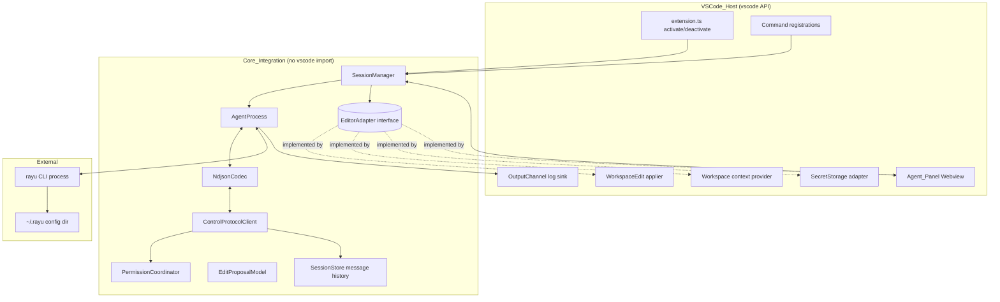

# Design Document: rayucode

## Overview

`rayucode` is an editor extension that surfaces the existing Rayu CLI agent inside a code editor. It does **not** reimplement the agent. Instead it spawns the existing `rayu` binary in headless streaming mode and drives it over the binary's bidirectional newline-delimited JSON (NDJSON) control protocol, rendering the agent's output and routing tool/permission decisions back to the user.

The first and primary target is Visual Studio Code. To allow future editors to reuse the integration without rewrites, the extension is split into two layers:

- **Core_Integration** — editor-agnostic. Owns process lifecycle, the control protocol, session state, and message streaming. Depends only on the `EditorAdapter` interface; contains zero `vscode` imports.
- **Editor_Host / VSCode_Host** — VS Code-specific. Implements `EditorAdapter` (panel surface, file-edit application, workspace queries, command registration, secret storage) using the `vscode` API.

This split directly satisfies Requirement 13 and is enforced at the package boundary (R13.5: the core package builds with no VS Code dependency present).

The grounding for the protocol is the actual CLI source:
- Launch contract and stdout message emission: `src/cli/print.ts` (`runHeadless`).
- NDJSON framing, request/response correlation, permission flow, abort/cancel semantics: `src/cli/structuredIO.ts` (`StructuredIO`).
- Message and control schemas: `src/entrypoints/sdk/coreSchemas.ts` and `src/entrypoints/sdk/controlSchemas.ts`.
- Input user-message envelope: `src/server/directConnectManager.ts`.

Requirements reference: #[[file:requirements.md]]

### Key grounded facts

- The CLI is launched headless with `--print --input-format=stream-json --output-format=stream-json --verbose`. The CLI rejects `stream-json` output without `--verbose` (`print.ts` lines ~785-789), so `--verbose` is mandatory.
- stdout carries a union of `StdoutMessage` types (`controlSchemas.ts` `StdoutMessageSchema`): `system/init`, `assistant`, `stream_event` (partial), `result`, `control_request`, `control_response`, `control_cancel_request`, `keep_alive`, plus streamlined/status variants.
- stdin accepts `StdinMessage` (`StdinMessageSchema`): `user` messages, `control_request`, `control_response`, `keep_alive`, `update_environment_variables`.
- A stray non-JSON stdout line is the CLI's own bug guard concern; on the host side a malformed line is logged and skipped (R4.3). The CLI installs a stdout guard that diverts non-JSON to stderr (`installStreamJsonStdoutGuard`), so stderr is expected to carry diagnostics, not protocol (R2.6).
- `session_id` is present on every emitted SDK message; the host records it as the resumable session identifier (R12.5).

## Architecture

### Layered structure



### Dependency direction (R13.1, R13.4, R13.5)

- Core_Integration imports the `EditorAdapter` TypeScript interface only. It never imports `vscode`.
- VSCode_Host imports both Core_Integration and `vscode`, constructs a concrete `VSCodeAdapter`, and injects it into the `SessionManager`.
- The repository is organized as two packages (e.g. `packages/core` and `packages/vscode`). `packages/core` has no dependency on `vscode` in its `package.json`, which makes R13.5 a build-enforceable invariant (a CI build of `packages/core` in isolation must succeed).

### Process model

- One `Session` ⇒ one `AgentProcess` ⇒ one `rayu` child process.
- The `SessionManager` owns the set of live sessions and is the single entry point the Editor_Host calls.
- The webview is a thin view: it holds no protocol logic, only renders state pushed from the host and posts user intents back.

## Components and Interfaces

### EditorAdapter (the abstraction boundary — R13.3)

```typescript
interface EditorAdapter {
  // Panel surface (R3.1)
  showAgentPanel(sessionKey: string): Promise<AgentPanelHandle>;

  // File edits (R6.2, R6.4, R6.5)
  applyFileEdits(edits: FileEditPlan): Promise<ApplyResult>;
  readFileSnapshot(path: string): Promise<FileSnapshot | null>; // for conflict detection (R6.3)

  // Workspace context (R9)
  getWorkspaceContext(options: ContextOptions): Promise<WorkspaceContext>;
  isPathIgnored(path: string): Promise<boolean>; // R9.6

  // Command registration (R14.1, R14.4)
  registerCommand(id: string, handler: (...args: unknown[]) => unknown): Disposable;

  // Secret storage (R8.4, R13.3)
  getSecret(key: string): Promise<string | undefined>;
  storeSecret(key: string, value: string): Promise<void>;

  // Diagnostics (R2.6, R15.3)
  log(channel: 'protocol' | 'lifecycle' | 'error', message: string): void;

  // User-visible notifications with actions (R1.2, R2.5, R6.3, R15.1)
  showActionableMessage(level: 'info' | 'warn' | 'error', text: string, actions: string[]): Promise<string | undefined>;

  // Settings access (R1.1, R1.3, R9.3, R9.4, R15.4)
  getSetting<T>(key: string, fallback: T): T;
}
```

`VSCodeAdapter` implements every member (R13.2) using `vscode.window.createWebviewPanel`, `vscode.WorkspaceEdit`, `vscode.workspace.fs`, `vscode.commands.registerCommand`, `context.secrets`, `vscode.window.createOutputChannel`, `vscode.window.showXMessage`, and `vscode.workspace.getConfiguration`.

### CliLocator (R1)

Resolves the executable in order: (1) explicit setting `rayucode.cliPath`, (2) system PATH lookup. On success it runs `<path> --version`, captures the reported version, and compares against `MINIMUM_RAYU_VERSION`.

```typescript
interface CliResolution {
  path: string | null;
  version: string | null;          // from `--version`
  belowMinimum: boolean;
}
```

- No executable ⇒ actionable "not found" message with a "Set path" action (R1.2) and **no** version message (R1.6).
- Resolved but below minimum ⇒ message stating detected + required versions; user may continue anyway (R1.5).

### AgentProcess (R2)

Wraps the spawned child. Responsibilities:

- Spawn with the streaming flags above, `cwd` = session workspace root (R2.3), and environment that points the CLI at the default `~/.rayu` config dir (R8.1) — i.e. inherit `HOME`/`RAYU` config resolution unchanged, never overriding the config dir.
- Pipe `stdout` through `NdjsonCodec` into the protocol client.
- Pipe `stderr` line-buffered into the `'lifecycle'`/`'error'` log channel only (R2.6) — never into the conversation.
- Track exit. On unexpected exit while the session is open, emit a `processExited` event carrying code/signal (R2.5).
- `terminate()`: send SIGTERM, await exit with a bounded grace period, escalate to SIGKILL, and resolve only after the OS confirms exit (R2.4).

```typescript
interface AgentProcess {
  readonly pid: number | undefined;
  start(): Promise<void>;
  writeLine(message: StdinMessage): void;
  onStdoutMessage(cb: (m: StdoutMessage) => void): void;
  onExit(cb: (info: { code: number | null; signal: string | null }) => void): void;
  terminate(): Promise<void>; // resolves only after confirmed exit
}
```

### NdjsonCodec (R4.1, R4.3)

- **Decode**: accumulate stdout chunks, split on `\n`, JSON-parse each complete line. A line that fails to parse is reported via an `onMalformedLine(raw, error)` callback (host logs it, R4.3) and decoding continues with subsequent lines. Mirrors `StructuredIO.read()` line-splitting in the CLI. Trailing partial line is buffered until the next chunk or EOF.
- **Encode**: serialize a message to JSON + `\n`. Encoding must never emit a bare newline inside the serialized payload that would split a record (handled by `JSON.stringify`, which escapes embedded newlines).

### ControlProtocolClient (R3, R4, R5, R7, R11, R12, R15)

Owns the typed view of the protocol and request/response correlation.

- **Inbound dispatch** by `type`:
  - `system/init` ⇒ initial model, tools, mcp_servers, slash_commands, skills, permissionMode, session_id (R7.1, R11.2, R12.5).
  - `assistant` ⇒ complete assistant message block (R3.3).
  - `stream_event` ⇒ partial content delta appended to the in-progress message (R4.1).
  - `result` ⇒ terminal message for a turn; marks in-progress complete and carries `usage`/`total_cost_usd`/`modelUsage` (R4.2, R4.4).
  - `control_request` with `subtype: 'can_use_tool'` ⇒ permission request routed to `PermissionCoordinator` (R5.1).
  - `control_response` ⇒ resolves a host-initiated request (set_model, mcp_status, interrupt) by `request_id`.
  - error result subtypes / assistant `error` field ⇒ surfaced as error text (R15.2) and auth-failure detection (R8.3).
- **Outbound requests** (host-initiated `control_request`, correlated by `request_id`, matching `structuredIO.sendRequest`):
  - `interrupt` (R3.6).
  - `set_model` (R7.3); `mcp_status` (R11.2 on demand); `set_permission_mode`.
  - Available models come from the `system/init` payload's `models` array and the initialize response (`SDKControlInitializeResponse.models`); a refresh uses the cached init data, falling back to `mcp_status`/init re-query (R7.2).
- **Outbound responses** (host answering a CLI `control_request`): permission `control_response` with `subtype: 'success'` and an allow/deny `PermissionToolOutput` payload (R5.2, R5.3).

Request correlation uses a `Map<request_id, PendingRequest>` exactly as the CLI does, so a `control_cancel_request` or stream close rejects pending requests deterministically.

### PermissionCoordinator (R5, R10)

- On an inbound `can_use_tool` request: consult the active `Permission_Mode`. If the tool category is auto-approved, immediately answer `allow` without prompting (R5.4). Otherwise present the request to the webview with tool name, parameters, and — for bash — the exact command string (R5.6, R10.4).
- The host responds with a `control_response`:
  - allow ⇒ `{ behavior: 'allow', updatedInput: <approved input> }` (R5.2).
  - deny ⇒ `{ behavior: 'deny', message: <reason> }` (R5.3).
- **Default-deny on close (R5.5)**: when a session closes, every still-pending permission request receives a `deny` response before the process is terminated. This is the host-side complement to the CLI's own "reject all pending on stream close" behavior in `StructuredIO.read()`.
- Tool action results (output) are forwarded to the conversation history with running indicators while a bash action is in flight (R10.1, R10.2, R10.3).

### EditProposalModel + edit application (R6)

The agent's file edits arrive as tool actions (Write/Edit) over the protocol. The Core_Integration converts an approved/aggregated set into a `FileEditPlan` and asks the adapter to apply it.

```typescript
interface FileEditChange {
  path: string;                 // workspace-relative
  kind: 'modify' | 'create';
  baseContentHash?: string;     // hash captured when proposal generated (R6.3)
  newContent: string;          // full new file content (or computed from edits)
}
interface FileEditPlan { changes: FileEditChange[] }
interface ApplyResult {
  applied: string[];
  failed: { path: string; reason: string }[];
  conflicts: { path: string }[];
}
```

`VSCodeAdapter.applyFileEdits`:
- For each change, read the current on-disk snapshot and compare its hash with `baseContentHash`. A mismatch is a conflict (R6.3): the adapter does not apply that file and reports it in `conflicts`; the host then requires explicit confirmation before re-applying with conflict override.
- Apply via a single `vscode.workspace.applyEdit(WorkspaceEdit)` per file (open-buffer aware, so open editors update in place — R6.4). New files use `WorkspaceEdit.createFile` at the workspace-relative path (R6.5).
- **Partial-failure isolation (R6.6)**: each file is applied independently; a failure on one file records it in `failed` and leaves all other files (applied or not-yet-attempted) untouched. The plan is not applied as one all-or-nothing transaction across files, but each file's own edit is atomic.

### Agent_Panel webview (R3, R4, R5, R7, R10, R11, R12)

- A `WebviewPanel` whose content is a bundled view. Communication is strictly message-passing over `postMessage`:
  - **Host → webview**: `appendPartial`, `addMessage`, `completeMessage`, `showPermissionRequest`, `showToolAction`, `updateToolStatus`, `showUsage`, `setModelInfo`, `setMcpStatus`, `showError`, `restoreHistory`.
  - **Webview → host**: `submitPrompt`, `interrupt`, `approvePermission`, `denyPermission`, `approveEdit`, `confirmConflict`, `selectModel`, `openModelList`, `newSession`.
- Rendering: assistant text is rendered as Markdown with fenced code blocks in monospace; diffs as per-file before/after (R3.7, R6.1). Markdown is rendered with a sanitizer and a strict webview CSP; no remote content is loaded.
- Order preservation (R3.4): the host assigns a monotonic receive-sequence number to each protocol message as the codec yields it, and the webview renders strictly in that order. Streaming deltas attach to the in-progress message by `parent`/sequence.
- In-progress indicator + interrupt control shown while a turn is active (R3.5).

### SessionStore (R12)

- In-memory ordered history per active session (R12.1). Survives panel close/reopen because it lives in the host, not the webview (R12.2).
- On reopen, the host sends `restoreHistory`; if reconstruction throws, the webview opens empty rather than failing (R12.3).
- `newSession` allocates a fresh, independent history and a new `AgentProcess` (R12.4).
- The latest `session_id` seen on any SDK message is stored as the resumable identifier (R12.5).

### VSCode_Host activation & packaging (R14)

- `package.json` manifest declares: commands `rayucode.openPanel`, `rayucode.addSelectionToPrompt`; settings `rayucode.cliPath`, `rayucode.includeActiveFile`, `rayucode.includeSelection`, `rayucode.permissionMode`, `rayucode.diagnosticLogging`, `rayucode.unresponsiveTimeoutMs` (R14.1).
- `engines.vscode` declares the minimum supported version (R14.3).
- `activationEvents` are lazy: `onCommand:rayucode.openPanel`, `onCommand:rayucode.addSelectionToPrompt` (R14.6).
- On activate, register commands; a registration failure is caught, logged to the channel, and activation continues (R14.5). The open-panel command is registered so it is invocable from the command palette (R14.4).
- Packaged with `vsce` into a single `.vsix` (R14.2).

## Data Models

### Protocol message envelopes (grounded in coreSchemas.ts)

```typescript
// Outbound to CLI (stdin) — matches SDKUserMessage / directConnectManager
type StdinUserMessage = {
  type: 'user';
  message: { role: 'user'; content: string | ContentBlock[] };
  parent_tool_use_id: string | null;
  session_id?: string;
};

// Inbound from CLI (stdout) — discriminated by `type`
type SystemInit = {
  type: 'system'; subtype: 'init';
  model: string; permissionMode: PermissionMode;
  tools: string[]; mcp_servers: { name: string; status: string }[];
  slash_commands: string[]; skills: string[];
  apiKeySource: string; cwd: string; claude_code_version: string;
  uuid: string; session_id: string;
};
type AssistantMessage = {
  type: 'assistant'; message: ApiAssistantMessage;
  parent_tool_use_id: string | null; error?: AssistantError;
  uuid: string; session_id: string;
};
type StreamEvent = {
  type: 'stream_event'; event: RawMessageStreamEvent;
  parent_tool_use_id: string | null; uuid: string; session_id: string;
};
type ResultMessage = {
  type: 'result';
  subtype: 'success' | 'error_during_execution' | 'error_max_turns'
         | 'error_max_budget_usd' | 'error_max_structured_output_retries';
  is_error: boolean; result?: string; num_turns: number;
  total_cost_usd: number; usage: Usage; modelUsage: Record<string, ModelUsage>;
  permission_denials: PermissionDenial[]; uuid: string; session_id: string;
};

// Control protocol (both directions)
type ControlRequest = { type: 'control_request'; request_id: string; request: ControlRequestInner };
type ControlResponseOk = { type: 'control_response'; response: { subtype: 'success'; request_id: string; response?: Record<string, unknown> } };
type ControlResponseErr = { type: 'control_response'; response: { subtype: 'error'; request_id: string; error: string } };
type ControlCancel = { type: 'control_cancel_request'; request_id: string };
```

`ControlRequestInner` subtypes used by rayucode (from `controlSchemas.ts`): `can_use_tool`, `interrupt`, `set_model`, `set_permission_mode`, `mcp_status`, `initialize`, `get_context_usage`.

### Permission output payload (grounded in PermissionResultSchema)

```typescript
type PermissionToolOutput =
  | { behavior: 'allow'; updatedInput?: Record<string, unknown>; toolUseID?: string }
  | { behavior: 'deny'; message: string; interrupt?: boolean; toolUseID?: string };
```

### Permission_Mode model (R5.4, R10.4)

Aligned with the CLI's `PermissionModeSchema` enum (`default`, `acceptEdits`, `bypassPermissions`, `plan`, `dontAsk`). rayucode's auto-approval policy is a pure function `shouldAutoApprove(mode, toolCategory) -> boolean`:

| Mode | Edit tools | Bash | Read-only |
|------|-----------|------|-----------|
| `default` | prompt | prompt | auto |
| `acceptEdits` | auto | prompt | auto |
| `bypassPermissions` | auto | auto | auto |
| `plan` | prompt (no exec) | prompt | auto |
| `dontAsk` | deny-if-not-preapproved | deny-if-not-preapproved | auto |

### Session state

```typescript
interface SessionState {
  key: string;                       // workspace-derived stable key
  resumableSessionId: string | null; // R12.5
  history: ConversationItem[];       // ordered, R12.1
  model: string | null;
  permissionMode: PermissionMode;
  pendingPermissions: Map<string, PendingPermission>;
  status: 'starting' | 'idle' | 'generating' | 'exited';
}
```

## Correctness Properties

*A property is a characteristic or behavior that should hold true across all valid executions of a system — essentially, a formal statement about what the system should do. Properties serve as the bridge between human-readable specifications and machine-verifiable correctness guarantees.*

The property-amenable parts of rayucode are pure, input-varying functions: the NDJSON codec, the message-ordering reducer, the permission default-deny-on-close logic, the auto-approval policy, and the edit-plan partial-failure isolation. UI rendering, VS Code API wiring, process spawning, and marketplace packaging are validated with example/integration/smoke tests instead (see Testing Strategy). The prework analysis below classifies every acceptance criterion.

### Property 1: NDJSON decode/encode round-trip

*For any* sequence of protocol messages, encoding each message to an NDJSON line and decoding the concatenated stream yields exactly the original sequence of messages in the same order.

**Validates: Requirements 4.1**

### Property 2: NDJSON decoder robustness and continuation

*For any* byte stream containing a mix of valid JSON lines and invalid (non-JSON) lines in any order, the decoder emits exactly the valid messages in order, reports each invalid line once via the malformed-line callback, and never drops a valid line that follows an invalid one.

**Validates: Requirements 4.3**

### Property 3: Chunk-boundary invariance of decoding

*For any* NDJSON byte stream and *any* partition of that stream into arbitrary chunks, feeding the chunks to the decoder in order produces the same message sequence as feeding the whole stream at once.

**Validates: Requirements 4.1, 4.3**

### Property 4: Message ordering preservation

*For any* sequence of inbound protocol messages, the conversation reducer renders items in the same relative order in which the messages were received from the stream.

**Validates: Requirements 3.4**

### Property 5: Streaming assembly equals final message

*For any* assistant turn expressed as a sequence of `stream_event` deltas followed by a terminal `result`, the text assembled by appending the deltas equals the final assembled content, and the in-progress item is marked complete exactly when the `result` is processed.

**Validates: Requirements 4.1, 4.2**

### Property 6: Permission default-deny on session close

*For any* set of pending permission requests at the moment a session is closed, every pending request receives exactly one `deny` response, and all deny responses are issued before the agent process is terminated.

**Validates: Requirements 5.5**

### Property 7: Auto-approval policy matches mode

*For any* permission mode and *any* tool-action category, the coordinator auto-approves without prompting if and only if `shouldAutoApprove(mode, category)` is true; otherwise it surfaces a prompt (or denies under `dontAsk`).

**Validates: Requirements 5.4, 10.4**

### Property 8: Allow response carries approved input

*For any* approved permission request, the emitted `control_response` has `behavior: 'allow'` and its `updatedInput` equals the input the user approved.

**Validates: Requirements 5.2**

### Property 9: File-edit partial-failure isolation

*For any* file-edit plan in which an arbitrary subset of changes fails to apply, every non-failing change's target ends in its intended post-edit state and every file not in the plan is unchanged, regardless of which subset failed.

**Validates: Requirements 6.6**

### Property 10: Conflict detection on stale base

*For any* edit change whose target's current on-disk content hash differs from the change's captured base hash, the apply step classifies that change as a conflict and does not modify the file without explicit confirmation.

**Validates: Requirements 6.3**

### Property 11: Credentials never appear in surfaced output

*For any* protocol message or stderr line whose content includes a value that matches the configured credential set, the text routed to the Agent_Panel and to the log channel does not contain that value in any form, including masked or partial forms.

**Validates: Requirements 8.4, 15.5**

### Property 12: Request/response correlation integrity

*For any* interleaving of host-initiated control requests and their responses, each response resolves exactly the pending request bearing the same `request_id`, and a stream close or cancel rejects every still-pending request exactly once.

**Validates: Requirements 7.3, 7.4, 15.2**

## Error Handling

- **CLI not found (R1.2)**: actionable message + "Set path" action; suppress version messaging (R1.6).
- **Version below minimum (R1.5)**: informational message with detected/required versions; continue allowed.
- **Process spawn failure (R15.1)**: surface the failure reason in the panel with a retry control.
- **Unexpected process exit (R2.5)**: show exit code/signal in the panel and offer restart.
- **Malformed NDJSON line (R4.3)**: log to channel, skip, continue.
- **Control protocol error message (R15.2)**: render the error text in the panel; resolve/reject the correlated pending request.
- **Auth failure (R8.3)**: detect from the agent's reported error, display it, and instruct the user to connect the provider via the Rayu CLI (do not attempt re-auth in the extension).
- **Model unavailable (R7.4)**: display the reported reason and keep the previously effective model.
- **MCP connect failure (R11.5)**: display the failure and the affected server name.
- **Unresponsiveness timeout (R15.4)**: if no protocol activity advances a pending prompt within `rayucode.unresponsiveTimeoutMs`, show an "agent unresponsive" notice with interrupt/restart controls.
- **Edit apply failure (R6.6)**: report per-file failure with path; leave other files unchanged.
- **Command registration failure (R14.5)**: log and continue activation.
- **Credentials guarantee (R15.5, R8.4)**: a redaction filter sits in front of both the panel sink and the log sink; credentials are only ever persisted to the editor secret store or left in `~/.rayu`.

## Testing Strategy

### Dual approach

- **Property-based tests** cover the pure, input-varying logic enumerated in Correctness Properties (codec, ordering reducer, streaming assembler, permission policy + default-deny, edit-plan isolation, conflict detection, redaction, request correlation).
- **Unit/example tests** cover concrete behaviors and edge cases: CLI locator ordering (setting → PATH), version-compare boundaries, specific control-request serialization, webview message contracts.
- **Integration tests** cover the VS Code-bound surfaces that don't vary meaningfully with input: `WorkspaceEdit` application against a temp workspace (open buffer + new file + conflict), command registration via the extension host, secret storage round-trip, and a smoke test that spawns a stub `rayu` emitting canned NDJSON and verifies end-to-end rendering.
- **Smoke/config tests**: manifest declares required commands/settings/`engines.vscode`; `.vsix` packages successfully (R14.2, R14.3).

### Property test configuration

- A property-based testing library for TypeScript (e.g. fast-check) — not hand-rolled.
- Minimum **100 iterations** per property.
- Each property test is tagged with a comment referencing its design property in the form:
  **Feature: rayucode, Property {number}: {property_text}**
- Each of Properties 1–12 is implemented by a single property-based test. The core package's property tests run with no `vscode` dependency present, reinforcing R13.5; the edit-isolation and conflict properties (9, 10) test the adapter logic against an in-memory file model so they remain pure and cheap.

### Requirements coverage map (R1–R15)

| Req | Design elements |
|-----|-----------------|
| R1 | `CliLocator`, `getSetting`, `showActionableMessage` |
| R2 | `AgentProcess` (spawn flags, cwd, stderr→log, terminate, restart), window-close cleanup in `deactivate` |
| R3 | `Agent_Panel` webview, `ControlProtocolClient` dispatch, ordering reducer, interrupt request |
| R4 | `NdjsonCodec`, `stream_event`/`result` handling, usage display, malformed-line logging |
| R5 | `PermissionCoordinator`, allow/deny `control_response`, auto-approve, default-deny-on-close, bash command display |
| R6 | `EditProposalModel`, `VSCodeAdapter.applyFileEdits` (conflict, open-buffer, create, partial-failure) |
| R7 | init `models`, `set_model` request, current model display, unavailable handling |
| R8 | default `~/.rayu` config dir launch, auth-failure surfacing, secret storage constraint |
| R9 | `getWorkspaceContext`, `isPathIgnored`, add-selection command, opt-in active file/selection |
| R10 | tool-action rendering, bash output/running indicator, approval gating |
| R11 | MCP availability via config dir, `mcp_status`, MCP status/failure rendering, skills passthrough |
| R12 | `SessionStore` (history retention, restore, new session, resumable session id) |
| R13 | `EditorAdapter` interface, `VSCodeAdapter`, two-package split with no-vscode core build |
| R14 | manifest contributions, lazy `activationEvents`, `engines.vscode`, registration-failure handling, `.vsix` |
| R15 | error surfacing + retry, control error rendering, diagnostic logging toggle, unresponsiveness timeout, redaction |
