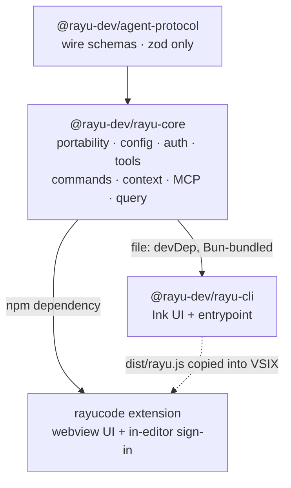

# Rayu Core Extraction — Migration Plan

Status: **proposed** · Owner: TBD · Companion to [WORKSPACE.md](./WORKSPACE.md) and [PROTOCOL.md](./PROTOCOL.md)

This document supersedes the package map in WORKSPACE.md §2 once Task 2 lands.
Until then WORKSPACE.md remains authoritative.

---

## 1. Goal

Turn `rayu/src` from a CLI *application* into a genuine shared package
(`@rayu-dev/rayu-core`), lift the Ink/terminal UI out of it, and have both
consumers depend on it:

| Consumer | Today | After |
|----------|-------|-------|
| `@rayu-dev/rayu-cli` | owns everything | Ink UI + entrypoint only |
| `rayucode` extension | spawns `dist/rayu.js`, duplicates readers | imports core; still spawns for execution |

Parity targets: same tools, commands, context, MCP, endpoints. The extension
gains in-editor sign-in so no terminal step is required.

---

## 2. Verified findings

Every claim below was checked against source. File:line references are the
evidence.

### 2.1 Feasibility is better than it looks

**The CLI build already targets Node.** `scripts/build.ts` calls
`Bun.build({ entrypoints: ['src/entrypoints/cli.tsx'], target: 'node', format: 'esm' })`
with a `#!/usr/bin/env node` banner. Bun is the *bundler*, not the runtime.

**A non-Bun macro path already exists.** `scripts/preload.ts` sets
`globalThis.MACRO = MACRO_VALUES` via `bunfig.toml` preload so `bun run dev`
works without a build. This is the precedent for replacing `MACRO.*`.

**Portability work has already started.** `utils/which.ts:59` is
`typeof Bun !== 'undefined' && typeof Bun.which === 'function' ? Bun.which : …`.
The same guarded-fallback pattern appears in `hash.ts`, `semver.ts`, `yaml.ts`,
`json.ts`, `sessionStoragePortable.ts`. A `*Portable.ts` naming convention
exists (`authPortable`, `getWorktreePathsPortable`, `execFileNoThrowPortable`).

**Tools already separate logic from UI** for most tools:
`tools/FileEditTool/FileEditTool.ts` + `tools/FileEditTool/UI.tsx`.

**The `Tool` interface is largely UI-agnostic.** Display members return
**strings** (`userFacingName`, `getToolUseSummary`, `getActivityDescription`) or
theme keys. React appears only via `SetToolJSXFn` (`Tool.ts:105`,
`jsx: React.ReactNode | null`).

### 2.2 Measured scope

All figures below are now **computed** by `rayu/scripts/analyze-boundary.ts`
(Task 1) rather than estimated, and pinned by `rayu/test/analyzeBoundary.test.ts`.
Scope matters: the plan's original greps covered `rayu/src` only, while tsconfig
`include` also covers `scripts/` and `test/`. Both are given.

| Metric | src/ | all | Note |
|--------|------|-----|------|
| Project files (`.d.ts` excluded) | **2189** | 2370 | |
| Files importing React | **636** ✓ | 638 | the 2 extra are `test/{image,video}GenTool.test.ts` |
| …importing React at runtime (not `import type`) | **631** | 633 | type-only edges are erased and cheap to repoint |
| Files using JSX with no React import | **0** | 0 | `jsx: "react-jsx"` makes this possible; verified absent |
| Files importing the `ink` **npm package** | **0** | 0 | see below — `ink` is an unused devDependency |
| Files in `src/ink/` (vendored Ink fork) | **102** | 102 | this, not the npm package, is the Ink coupling |
| Files importing `bun:bundle` | **197** | 197 | plan previously said 196 |
| `Bun.*` accesses (AST, not regex) | **25 in 13 files** | 42 in 22 | plan previously said ~50 in 27 |
| …guarded / guard-expression / try-guarded | 21 / 3 / 1 | 21 / 3 / 4 | |
| …**unguarded** | **0** | 14 | all 14 are in `scripts/` + `test/`, Bun-only by design |
| `MACRO_VALUES` entries | **11** ✓ | | `scripts/macroValues.ts` |
| `ENABLED_FEATURES` flags | **4** ✓ | | `ULTRATHINK`, `TOKEN_BUDGET`, `BUILTIN_EXPLORE_PLAN_AGENTS`, `EXTERNAL_AGENTS` |
| Mixed UI/logic tools | **5** ✓ | | Bash, PowerShell, Agent, AskUserQuestion, TaskOutput |
| React-coupled files in `services/mcp/` | **2** ✓ | | `useManageMCPConnections.ts`, `MCPConnectionManager.tsx` |
| Accepted type debt | **1557 errors** | | across **983 signatures** and **315 files** |
| `build.ts` EXTERNAL / STUB_ALIASES | 12 / 7 | | read out of the build script's AST |

Three corrections worth calling out, because they change what the tasks do:

**"983 accepted typecheck errors" was the signature count, not the error count.**
`typecheck-baseline.json` holds 983 `<file>|<code>|<message>` keys totalling
**1557** errors over **315** files. Per-wave debt must be summed by error count.

**Nothing imports the `ink` npm package.** `ink@^7.0.5` is a declared
devDependency with zero importers; the terminal UI is the 102-file vendored fork
in `src/ink/`. A purity gate keyed on the `ink` *specifier* would pass on all of
it, so the gate keys on `src/ink/` plus `react`.

**`src/` contains zero unguarded `Bun.*` accesses.** Task 5 is not merely
"near-no-op" — it is already done inside `src/`. `ripgrep.ts:607` is
`try-guarded` (inside a `try` block, so a `ReferenceError` under plain Node is
caught), not bare. Its `eslint-disable custom-rules/require-bun-typeof-guard`
names a rule that **does not exist in this repo** — there is no eslint config at
all. That comment is vestigial from the upstream material.

Confirmed UI-free and safe to extract: `QueryEngine.ts`, `query.ts`,
`context.ts`, and `claudemd.ts` — which lives at **`src/utils/claudemd.ts`**;
`src/claudemd.ts` does not exist.

### 2.6 The structural blocker: one import cycle holds 74% of `src/`

This is the finding that most changes the plan, and it is why every Phase B wave
reported a nearly identical closure of ~2040 files: **they are not different
files per wave, they are the same single cycle.**

| Measure | Value |
|---------|-------|
| Strongly connected components with size > 1 | **2** |
| Files inside a cycle | **1621** |
| Largest single cycle | **1618 files** (74% of `src/`) |
| …of which impure (React / UI / Bun-only) | **750** |

That one component contains `src/screens/REPL.tsx` **and** `src/tools.ts`,
`src/query.ts`, `src/commands.ts` — i.e. the React UI and every Phase B
extraction target are mutually recursive. A file inside it cannot be moved to
core on its own at any cost: following its imports leads back to itself through
the UI.

Measured movability of `src/` (a file is *movable* when it is pure, its whole
transitive closure is pure, and every import in that closure resolves):

| Scenario | Movable | Pure but dependency-blocked | Impure |
|----------|---------|-----------------------------|--------|
| today | **293** | 990 | 902 |
| after Task 4 (`bun:bundle` → core `feature()`) | **303** | 1105 | 772 |
| + every other `bun:*` module | 303 | 1105 | 771 |
| + type-only edges repointed to leaf type modules | **415** | 980 | 771 |

**Task 4 makes ~130 files pure but improves movability by only 10.** The freed
files are still trapped in the cycle with the UI. The intuitive read — "
`bun:bundle` is the blocker, so the codemod unblocks the migration" — is wrong,
and was measured rather than argued.

The ranked cut list (`--cut-candidates`) shows where the leverage actually is.
The most-depended-on impure modules, by how many otherwise-pure files import
them:

| Pure importers | of which type-only | Target | Impure because |
|---|---|---|---|
| 145 | 0 | `src/utils/log.ts` | `bun:bundle` only |
| 142 | 0 | `src/utils/slowOperations.ts` | `bun:bundle` only |
| 109 | 98 | `src/commands.ts` | `bun:bundle` only |
| 76 | 8 | `src/utils/config.ts` | `bun:bundle` only |
| 76 | 1 | `src/utils/settings/settings.ts` | `bun:bundle` only |
| 34 | 29 | `src/entrypoints/agentSdkTypes.ts` | UI directory |
| 29 | **29** | `src/state/AppState.tsx` | React |
| 13 | **13** | `src/entrypoints/sdk/controlTypes.ts` | UI directory |
| 11 | 0 | `src/ink/stringWidth.ts` | UI directory **only** |
| 10 | **10** | `src/hooks/useCanUseTool.tsx` | UI dir + React |

Two cheap classes of fix fall out of that table:

1. **Targets imported 100% type-only** (`AppState.tsx` 29/29,
   `controlTypes.ts` 13/13, `useCanUseTool.tsx` 10/10) cost nothing at runtime.
   Moving the *type* to a leaf module removes the edge; the implementation stays
   put. Worth more than the whole Task 4 codemod (+112 movable vs +10).
2. **129 files are impure by location only** — under `src/components/`,
   `src/ink/` etc. but importing no React and using no Bun-only API.
   `src/ink/stringWidth.ts` is the clearest case: a string-width utility that 11
   pure files call at runtime, "UI" purely because of its directory. The fix is
   `git mv`, not a rewrite.

**Consequence for sequencing.** Phase B as written — move config, then tools,
then commands, then context, then query — cannot execute in that order, because
all five live in the same cycle. Cycle-breaking has to become an explicit task
that precedes them, driven by the ranked cut list above. See §6 Task 5b.

### 2.3 The extension's current auth is deliberate, not missing

`rayucode/packages/vscode/src/rayuSession.ts` reads **and writes**
`~/.rayu/rayu-auth.json` via `node:fs`. Its header documents two decisions:

1. It duplicates ~40 lines of `rayu/src/services/rayuAuth/rayuSession.ts`
   because WORKSPACE.md §3 forbids importing `rayu/src`.
2. It shares the CLI's file rather than storing its own token because there is
   one account, one machine, one user. A second store would mean *"two OAuth
   flows, two refresh cycles racing to rotate the same refresh token, and a user
   who is signed in to the CLI but mysteriously not to the panel embedding it."*

**Consequence:** any design introducing a second credential store is wrong. The
`EditorAdapter.getSecret`/`storeSecret` pair (`adapter.ts:137-138`,
`vscodeAdapter.ts:440-445`) is **dead code** with zero production callers and is
*not* part of the auth path. `AgentProcessFactoryOptions` forwards only
`Pick<EditorAdapter, "log">` to the child, and `SDKControlInitializeRequest` has
no credential field — the spawned engine authenticates itself from the file.

### 2.4 The extension discards capabilities it already receives

`SDKSystemMessageSchema` (`packages/agent-protocol/src/coreSchemas.ts:1527-1552`)
carries:

```
protocolVersion, agents, apiKeySource, betas, claude_code_version, cwd,
tools: z.array(z.string()),
mcp_servers: z.array(z.object({ name, status })),
model, permissionMode,
slash_commands: z.array(z.string()),
output_style: z.string(),
skills: z.array(z.string()),
plugins
```

`sessionManager.ts:1085-1098` consumes only `model`, `permissionMode`, and
`mcp_servers`. `tools`, `slash_commands`, and `skills` are dropped.

**No protocol change is required to fix this.** Meanwhile
`chatParticipant.ts` hardcodes 4 fake slash commands in
`SLASH_COMMAND_INSTRUCTIONS` that merely prepend English prose, against ~81 real
commands in `rayu/src/commands/`.

### 2.5 Three credential backends, not one

| Backend | Path | Mechanism |
|---------|------|-----------|
| `services/rayuAuth/rayuSession.ts` | `~/.rayu/rayu-auth.json` | raw `fs`, `0600` |
| `utils/secureStorage/` | `~/.rayu/.credentials.json` | platform dispatch (macOS Keychain, libsecret, plaintext fallback) |
| `utils/authFileDescriptor.ts` | FD or well-known path | CCR container |

`rayu-auth.json` bypasses the `secureStorage` interface entirely.

---

## 3. Corrections log

Kept for auditability, since wrong counts drove wrong scope.

### 3.1 Errors in earlier drafts of this plan

| Claim | Truth | Cause |
|-------|-------|-------|
| `feature()` in ~40 files | **196** | estimated from a grep truncated by `max_matches_per_file` |
| ~250 `Bun.*` call sites | **~50** | one regex conflated 196 `bun:bundle` + ~50 `Bun.*` |
| `heapDumpService.ts` unguarded | both calls **guarded** | not read closely |
| 3 mixed tools | **5** | hand-listed instead of enumerated |
| ~15 MACRO values | **11** | estimate |
| 4 flags (listed 3) | 4th is `EXTERNAL_AGENTS` | omission |
| Extension has no auth | `rayuSession.ts` **exists** | generalized from one error string in `webBridge.ts:83` |
| "Split `MCPConnectionManager.tsx` like the tools" | **not separable** | assumed symmetry with tools |
| React files: 632 | **636** | multi-line imports + gitignored `skills/` files |

**Root cause:** estimating from truncated samples and hand-listing files. Task 1
exists to remove that failure mode permanently.

### 3.1b Errors Task 1 found in this plan, once the boundary became computable

The analyzer's first run corrected nine more claims. This is the failure mode
closing itself: the numbers are now produced by a program and asserted by tests.

| Claim in this plan | Measured truth | Why the plan was wrong |
|---|---|---|
| `claudemd.ts` at `src/claudemd.ts` | `src/utils/claudemd.ts` | path never checked against disk |
| `utils/mcp/*` is the MCP layer | `utils/mcp/` holds **2** files; the 22-file bulk is `services/mcp/` | assumed from the name |
| 196 files import `bun:bundle` | **197** | off-by-one; a direct grep also returns 197 |
| ~50 `Bun.*` sites in 27 files | **42 in 22** repo-wide, **25 in 13** in `src/` | regex counted comments and `'bun.lock'` / `'bun.sh'` strings, case-insensitively |
| `ripgrep.ts:607` is unguarded | **`try-guarded`** | inside a `try` block; and the eslint rule its disable names does not exist — there is no eslint config in the repo |
| "lift the Ink UI out" implies an `ink` dependency | the `ink` npm package has **0 importers**; coupling is the 102-file `src/ink/` fork | conflated the package with the vendored fork |
| 983 accepted typecheck errors | 983 **signatures**, **1557 errors**, 315 files | signature count read as an error count |
| Task 6 moves "dependency-free utils" incl. `path`, `hash`, `semver`, `yaml`, `json`, `which` | `path.ts`, `json.ts`, `which.ts` each reach the React UI transitively; 16 of the wave's 49 entries are not leaves | "leaf" assumed from the directory, not computed |
| Phase B moves subsystems in waves | all five Phase B targets sit in **one 1618-file cycle** with the UI | no cycle analysis existed |

The last row is not a counting error but a structural one, and it is the reason
§2.6 and Task 5b exist.

### 3.2 One review claim corrected

A review asserted `tools`/`slash_commands`/`skills` are absent from the
`SystemInit` schema and that consuming them needs a protocol change plus a
coordinated release. They are present — see §2.4. That task is
extension-only and front-loadable.

---

## 4. Target architecture



Consumption lands in two phases: `file:../packages/rayu-core` first (compile per
deploy, zero publish risk, proven by `agent-protocol`), then npm once the export
surface stops moving.

**Tool execution stays in a spawned process.** Tools spawn processes, write
files, and reach native deps; running them in the extension host risks blocking
the IDE. The extension imports core for definitions, config, auth, context, and
MCP metadata.

---

## 5. Invariants that must not break

1. **`@rayu-dev/rayu-cli` keeps zero runtime `dependencies`.** Its manifest
   documents that declaring them made `npm install -g` resolve and compile ~80
   packages including sharp prebuilds, "which is what made a global install fail
   differently on every machine." Core is a **devDependency, Bun-bundled**.
2. **`rayu/` stays outside the npm workspace.** `packages/rayu-core` joins it.
3. **`PROTOCOL_VERSION = 1` hard equality** (PROTOCOL.md). No extraction wave may
   perturb the wire format.
4. **One Zod instance** — pinned `^4.4.3`, `zod/v4` subpath, everywhere. A dual
   instance makes `instanceof` and `safeParse` disagree across boundaries.
5. **One credential store per identity.** No second token store.
6. **Published `files` stays `["dist/rayu.js", …]`** — the installer extracts
   only `dist/rayu.js`.

---

## 6. Tasks

### Phase 0 — Make the boundary computable

#### Task 1: Import-graph analyzer and core-purity gate — **DONE**

**Delivered.**
- `rayu/scripts/analyze-boundary.ts` — TypeScript compiler API. `createSourceFile`
  + AST walk (no `createProgram`: only the import graph is needed, so a full run
  takes ~4s), `ts.resolveModuleName` with the compiler's resolution cache so
  tsconfig `paths` aliases, extension substitution and index resolution behave
  exactly as `tsc` does.
- `rayu/test/analyzeBoundary.test.ts` — 36 tests, 4312 assertions, pinning every
  figure in §2.2 and §2.6.
- `rayu/boundary-baseline.json` + `bun run boundary` / `boundary:update` — the
  gate, following the same shrink-only contract as `typecheck-baseline.json`.

**What it computes.** Per-file classification (`ui-directory`, `imports-react`,
`uses-jsx`, `imports-bun-bundle`, `imports-bun-builtin`, `unguarded-bun`);
transitive closures with a shortest-path explanation of *why* a file is reachable;
strongly connected components; a movability fixpoint; a ranked cut list; and
per-file type-debt buckets from `typecheck-baseline.json`.

**Decisions worth recording.**
- `EXTERNAL` and `STUB_ALIASES` are parsed out of `scripts/build.ts`'s AST rather
  than copied. `build.ts` calls `Bun.build()` at module scope so it cannot be
  imported without triggering a build, and duplicating the arrays would let them
  drift. A rename of either const throws.
- `Bun.*` detection is AST-based (`PropertyAccessExpression`/
  `ElementAccessExpression` on identifier `Bun`), which is what removed the
  comment- and string-literal inflation in the old regex count. Guards are
  classified by walking ancestors for the four shapes actually present in the
  repo: `if (typeof Bun !== 'undefined')`, `&&`-chains, guarded ternaries, and
  early-return guards, plus module-scope flag consts and the verified
  `isRunningWithBun` / `isInBundledMode` predicates.
- JSX is detected as *syntax*, because `jsx: "react-jsx"` makes a `.tsx` file
  depend on `react/jsx-runtime` with no import to find. 29 `.tsx` files have no
  React import; all 29 turn out to contain no JSX, so the count is 0 — but the
  detector stays wired, since without it such a file would be reported as pure.
- Files resolved outside the tsconfig program — the `stubs/` tree reached through
  the `@ant/*` alias, and `.d.ts` files — are reported as `outsideProgram`, not
  as closure members, so no caller can read facts that do not exist.
- Type-only edges are tracked separately throughout, because whether an edge is
  erased at runtime decides whether the fix is "move a type" or "untangle code".

**Verification.** `bun test test/analyzeBoundary.test.ts` 36/36. Mutating the
if-statement guard recognition fails 4 tests; injecting one `import type
{ ReactNode } from 'react'` into a pure file makes the gate exit 1 on all 8
waves. Full tree: `bun run typecheck:ci` 0 new errors, `bun run build` OK,
`node dist/rayu.js --version` → 1.6.23, `npm run check:installer` OK.

**Usage.**
```bash
bun run boundary                          # summary, cycles, movability, gate
bun run scripts/analyze-boundary.ts --wave task11-query      # one wave, with paths
bun run scripts/analyze-boundary.ts --per-entry task6-pure-leaves  # name non-leaves
bun run scripts/analyze-boundary.ts --cut-candidates         # ranked edges to break
bun run scripts/analyze-boundary.ts --movable                # today's move list
bun run scripts/analyze-boundary.ts --why src/query.ts       # explain one file
bun run scripts/analyze-boundary.ts --json boundary.json     # machine-readable
```

---

### Phase A — Portability

#### Task 2: Scaffold `packages/rayu-core`

**Objective.** ESM package emitting declarations, zod pinned `^4.4.3` on
`zod/v4`. **`packages/rayu-core` joins the root npm workspace; `rayu/` does
not** — it consumes core as a `file:` devDependency exactly as it consumes
`agent-protocol`. Amend WORKSPACE.md §2/§3 in the same change.

**Tests.** Builds with 0 errors; importable from both consumers; a test asserts
`rayu/package.json` still has no `dependencies` key.

**Demo.** `dist/index.js` + `dist/index.d.ts`; WORKSPACE.md reflects the new map.

#### Task 3: `MACRO.*` → generated `buildConfig`

**Objective.** Move the 11 values from `scripts/macroValues.ts` into core,
preserving exact precedence: `RAYU_BUILD_*` → plain env → literal default. Keep
`--define` working during migration so nothing breaks mid-flight.

**Tests.** All 11 resolve identically to `MACRO_VALUES` under each env
permutation, including `RAYU_OAUTH_DEFAULT` defaulting to `'true'` and the three
URLs (`api.rayucode.com/api`, `rayucode.com`, `gateway.rayucode.com`).

**Demo.** Core reports the same endpoints the CLI bakes in.

#### Task 4: `feature()` codemod across 196 files

**Objective.** Replace `import { feature } from 'bun:bundle'` with core's
`feature()`, preserving all 4 enabled flags. Keep Bun's `features:` build option
so the CLI retains dead-code elimination.

**Guidance.** Use ts-morph, not sed — import forms vary. Largest mechanical
change in the plan; land it as one reviewable commit plus the codemod script.

**Tests.** Exactly 0 remaining `bun:bundle` imports; a drift test asserts core's
allowlist equals `macroValues.ts`'s `ENABLED_FEATURES`.

**Demo.** `feature()` resolves correctly under both `bun run` and plain `node`.

#### Task 5: `Bun.*` residual audit (near-no-op)

**Objective.** Confirm the guarded sites. `ripgrep.ts:607` keeps its unguarded
`Bun.spawn` — it is intentional, carries an eslint-disable, and sits on a
Bun-only path, so it stays CLI-side. `ink/stringWidth.ts` and `ink/wrapAnsi.ts`
are UI and stay CLI-side by definition.

**Tests.** Portability suite passes under `node` and `bun`. Note `hash.ts`
documents that `Bun.hash` and the fallback produce **different values** — assert
stability, not equality.

**Demo.** Analyzer reports zero unguarded `Bun.*` inside the core closure.

**Status note.** Task 1 shows this is already true: `src/` has **zero** unguarded
`Bun.*` accesses today (21 guarded, 3 guard expressions, 1 try-guarded). All 14
unguarded sites are in `scripts/` and `test/`, which run only under Bun. Task 5
reduces to keeping it that way, which the `boundary` gate now does.

#### Task 5b: Break the cycle — **NEW, blocks all of Phase B**

**Why this task exists.** Task 1 measured a single strongly connected component
of **1618 files (74% of `src/`)** containing `src/screens/REPL.tsx` together with
`src/tools.ts`, `src/query.ts` and `src/commands.ts` (§2.6). Phase B's waves are
all inside it. Until it is broken, "move the config layer" is not a file move —
following any member's imports leads back through the React UI. Only **293** of
2189 `src/` files are movable today, and Task 4 alone raises that to 303.

**Objective.** Drive movability up by cutting the highest-ranked edges, in
increasing order of cost. The analyzer's `--cut-candidates` output is the work
queue; `--movable` measures progress; the `boundary` gate prevents backsliding.

**Order of work, cheapest first.**

1. **Relocate the 129 "UI by location only" files.** No React, no Bun-only API —
   they are UI purely because of their directory. `src/ink/stringWidth.ts` is the
   canonical case: a string-width utility 11 pure files call at runtime. `git mv`
   plus import updates.
2. **Repoint the 100%-type-only edges.** `src/state/AppState.tsx` (29 of 29
   importers type-only), `src/entrypoints/sdk/controlTypes.ts` (13/13),
   `src/hooks/useCanUseTool.tsx` (10/10), `src/entrypoints/agentSdkTypes.ts`
   (29 of 34). Extract the imported types into leaf type modules; the
   implementations stay where they are. Measured worth: **+112 movable**, versus
   +10 for the entire Task 4 codemod.
3. **Then Task 4**, which converts ~130 files from impure to pure and is a
   prerequisite for the hub modules (`utils/log.ts`, `utils/slowOperations.ts`,
   `utils/config.ts`, `utils/settings/settings.ts`) that 145/142/76/76 pure files
   depend on.
4. **Re-measure and re-rank.** Each cut changes the graph, so the queue is
   regenerated rather than planned up front.

**Tests.** `--movable` count strictly increases per step; the `boundary` gate
stays green; `bun test` and `typecheck:ci` unchanged. No behaviour change is
intended in this task at all — it is pure dependency-direction work.

**Demo.** `bun run boundary` reports the largest cycle shrinking and the movable
count rising, both of which are currently 1618 and 293.

---

### Phase B — Extraction (move lists come from Task 1)

#### Task 6: Pure leaves

**Corrected scope (Task 1).** The wave as originally written does not work:
`utils/path.ts`, `utils/json.ts` and `utils/which.ts` are *not* dependency-free
(`path.ts` pulls in `cwd`, `fsOperations`, `platform`, `windowsPaths` and
re-exports from `sessionStoragePortable`; `which.ts` pulls `execSyncWrapper`;
`json.ts` pulls `log`, `memoize`, `slowOperations`). 16 of the wave's 49 entries
reach the whole application, including all of `src/constants/{prompts,
outputStyles,figures,spinnerVerbs,system,systemPromptSections,tools}.ts` and
`src/types/{command,hooks,logs,message,plugin,textInputTypes}.ts`.
`src/constants/prompts.ts:27` imports `'src/commands.js'` through the tsconfig
`src/*` alias — the edge that drags in the command tree, `components/Messages.tsx`
and `screens/REPL.tsx`.

The real move list is whatever `--movable` reports (**293** files today), not a
hand-written directory list. `src/constants/betas.ts` and `src/types/permissions.ts`
are genuine leaves blocked *only* by `bun:bundle`, so they land the moment Task 4
does — which is why Task 4 must precede this wave.

Re-export from `rayu/src` so no call site changes yet. **Tests:** `bun test`
green; the typecheck baseline must not grow; `bun run boundary` still green.

#### Task 7: Config, endpoints, and three credential backends

**Objective.** Move `utils/rayuConfig.ts`, `utils/config.ts`,
`utils/rayuProviders.ts`, `constants/{oauth,product}.ts`, and
`services/rayuAuth/*`. Define one `CredentialStore` interface covering **all
three** backends from §2.5.

**Out of scope, deliberately.** Unifying `rayu-auth.json` onto `secureStorage` is
a separate follow-up task; folding it in here would mix a refactor with a move.

**Tests.** Refresh/expiry/`getValidRayuAccessToken()` against a fake store;
`0600` preserved; each backend satisfies the interface contract.

**Demo.** `rayu` login unchanged, now running core's code.

#### Task 8a: Tool logic (mechanical, bounded)

**Objective.** Move `Tool.ts` and every `XTool.ts`. Split all 5 mixed tools into
`XTool.ts` + `UI.tsx`: `BashTool`, `PowerShellTool`, `AgentTool`,
`AskUserQuestionTool`, `TaskOutputTool`. `SetToolJSXFn` stays CLI-side.

**Tests.** Per-tool logic tests import no React; analyzer asserts core's bundle
contains no `react`/`ink` specifier.

**Demo.** Individual tools importable from core in plain Node.

#### Task 8b: Extract the `tools.ts` registry (design + extraction)

**Objective.** The hardest target in the plan. `tools.ts` touches ~40 tool
implementations, ~12 feature/env gates, permission filtering
(`getDenyRuleForTool`, `filterToolsByDenyRules`), MCP tool-pool assembly
(`assembleToolPool`, `getMergedTools`), coordinator mode, and carries
circular-dependency workarounds (`getTeamCreateTool()` and similar).

**Guidance.** Untangle before moving, in this order: (1) permission filtering,
(2) MCP pool assembly, (3) coordinator coupling, (4) replace the lazy-getter
cycle breakers with explicit injection. Only then move the file.

**Tests.** Registry returns an identical tool set to the CLI for the same
env/flags/permission context — table-driven across the gate combinations.

**Demo.** `getAllBaseTools()` / `getTools()` served from core.

#### Task 9: Command registry

Move each command's non-UI half plus `commands.ts`, exposing a real slash-command
registry (name, description, argument schema, handler). Interactive `.tsx`
command UIs stay CLI-side. **Tests:** registry count matches `src/commands/` so a
new command cannot be silently omitted.

#### Task 10: Context and MCP

**Objective.** Move `utils/analyzeContext.ts`, `context.ts`,
`src/utils/claudemd.ts` (not `src/claudemd.ts` — that path does not exist),
`utils/mcp/*` (only 2 files: `dateTimeParser.ts`, `elicitationValidation.ts`) and
`services/mcp/*` — which is where the 22-file MCP layer actually lives —
**except** `useManageMCPConnections.ts` and `MCPConnectionManager.tsx`.

**Rationale for the exception.** `MCPConnectionManager.tsx` is a thin 72-line
React context provider whose logic lives in `useManageMCPConnections.ts` — a
1049-line React hook using `useCallback` (12×), `useEffect` (5×), `useRef` (4×),
hook-selector state (`useAppState(s => s.authVersion)`), and a notifications
context. That is a rewrite, not a split. Connection lifecycle stays in the CLI's
UI layer; core gets the pure parts (`config`, `normalization`, `types`,
`envExpansion`, `oauthPort`, `auth`, `client`).

Abstract the OAuth loopback listener so the extension can supply a VS Code
`UriHandler` instead of `createServer`.

**Tests.** Context output identical to the CLI's for a fixture workspace; MCP
config parse/validate; server lifecycle against a stub transport.

#### Task 11: Query engine and session

**Objective.** `QueryEngine.ts`, `query.ts`, `utils/messages.ts`,
`sessionStorage`/`sessionStoragePortable`, permissions.

**Guidance.** Publish `query.ts`'s dependency graph from Task 1 **before moving
anything**. Both `QueryEngine.ts` and `query.ts` are confirmed React-free, but
their transitive closures are not yet enumerated.

**Tests.** A scripted headless turn — prompt → tool call → permission → result —
asserted end to end.

**Demo.** A core-only script runs a full agent turn with no Ink.

#### Task 12: Reduce the CLI to a UI consumer

`rayu/` keeps `entrypoints/`, `ink/`, `components/`, `screens/`, `hooks/` and
imports the rest from core. **Tests:** full `bun test`;
`node dist/rayu.js --version`; `npm run check:installer`; published `files`
unchanged.

#### Task 13: npm-consumption compatibility

**Objective.** The extension consumes core as a real npm dependency with no Bun
bundler, so native modules need a story: keep `sharp`, `modifiers-napi`, and the
OTEL exporters behind optional dynamic `import()` with the existing try/catch
guards.

**Reduced scope.** `stubPlugin`'s `@ant/*` aliases are a non-issue — every
computer-use import sits behind `feature('CHICAGO_MCP')`, which is **off**, so
they are dead-code-eliminated; `@ant/claude-for-chrome-mcp` has no import at all.

**Tests.** `npm install` core into a bare Node project and import it with no
native modules present; assert no unresolved specifier.

#### Task 14: Hold the protocol version invariant

Add a schema-hash test so any wave that perturbs the wire format fails loudly.
Any deliberate bump is a coordinated simultaneous CLI + extension release.

---

### Phase C — Extension

Tasks 15–18 depend on nothing in Phase B and may run in parallel with Phase A.

#### Task 15: In-editor sign-in, one shared store

**Objective.** Implement the OAuth flow inside VS Code
(`vscode.env.openExternal` + a `UriHandler`) and write the result to the **same**
`~/.rayu/rayu-auth.json`, preserving `0600`. Replace the `webBridge.ts:83`
"run `rayu` in a terminal" message with the in-editor flow.

**Explicitly not doing.** No second credential store, and no use of
`EditorAdapter.getSecret`/`storeSecret` — see §2.3. The spawned engine reads the
file itself, so no credential injection into `initialize` is needed.

**Tests.** Sign-in writes a session the CLI accepts; mode stays `0600`; no token
reaches the output channel (extend the existing redaction battery); concurrent
refresh does not corrupt the file.

**Demo.** Sign in entirely inside VS Code; `rayu` in a terminal is already
signed in.

**Follow-up.** Decide whether the dead `getSecret`/`storeSecret` pair gets a real
use or is deleted.

#### Task 16: Surface the discarded init fields

**Objective.** Persist and render `tools`, `slash_commands`, and `skills`
alongside the three fields `sessionManager.ts:1085-1098` already consumes. No
protocol change — the schema already carries them (§2.4).

**Tests.** An init carrying all fields populates state; a malformed one degrades
safely, reusing the existing webview-resilience pattern.

**Demo.** The panel shows the engine's real tool, command, and skill inventory.

#### Task 17: Real slash commands

Drive the palette from the engine's announced `slash_commands` (later core's
registry), replacing the 4 hardcoded `SLASH_COMMAND_INSTRUCTIONS` entries, and
execute via the control protocol rather than prepending English prose.

#### Task 18: MCP management and context/@-mentions

Add/remove/authenticate MCP servers using core's MCP layer; file, selection, and
image mentions using core's context assembly. **Tests:** context payload matches
the CLI's for the same workspace.

#### Task 19: Delete the duplication

Replace the extension's ~40 duplicated `rayuSession` lines with a core import.
This retires the WORKSPACE.md §3 workaround and is the migration's payoff.

#### Task 20: Publish

Publish `@rayu-dev/rayu-core`; flip both consumers from `file:` to a version
range; record the core version in `dist/build-info.json` for runtime mismatch
detection per PROTOCOL.md §7.

---

## 7. Effort

| Area | Estimate | Driver |
|------|----------|--------|
| Task 1 analyzer | Medium | greenfield, but de-risks everything after |
| Task 3 MACRO | Low | 11 values, precedent exists |
| Task 4 codemod | **Medium-high** | 196 files |
| Task 5 Bun residual | **Near-zero** | already guarded |
| Task 7 auth/config | Medium | three backends |
| Task 8a tools | Medium | +2 mixed splits |
| Task 8b `tools.ts` | **High** | permission + MCP + coordinator untangling |
| Task 10 context/MCP | Medium | 2 files excluded, rest clean |
| Task 11 query/session | **High** | largest closure |
| Task 13 npm consumption | Low-medium | reduced by CHICAGO_MCP being off |
| Tasks 15–18 extension | Medium | parallelizable |

---

## 8. Risks

| Risk | Mitigation |
|------|------------|
| 983 baseline errors block declarations | Per-wave zero-error gate on moved files; baseline shrinks, never grows |
| Hand-listed scope goes wrong again | Task 1 computes every move list; purity gate in CI |
| Native deps leak into the extension | Optional dynamic `import()` + a test importing core with no natives present |
| CLI zero-runtime-deps invariant breaks | Core stays a devDependency; test asserts no `dependencies` key |
| Dual Zod instances | Single pin asserted by test |
| Extension host blocked | Tool execution stays in a spawned process |
| Two token stores race the refresh | Single shared store, per §2.3 |
| Wire format drifts silently | Task 14 schema-hash test |

---

## 9. Sequencing

```
Task 1  ─── DONE ──────────────────────────────────────►  (gates everything)
        ├── Phase A: 2 → 3 → 5 → 4 → 5b
        │            └── Phase B: 6 → 7 → 8a → 8b → 9 → 10 → 11 → 12 → 13 → 14
        └── Phase C: 15, 16, 17, 18  (parallel with Phase A)
                                  └── 19 → 20  (after core exists)
```

**Revised by Task 1.** Task 5 moved ahead of Task 4 because it is already
satisfied (`src/` has zero unguarded `Bun.*`), so it costs only a gate. Task 5b
(break the 1618-file cycle) was inserted, and **Phase B cannot start before it**:
all five Phase B targets are inside that one cycle, so their waves are not file
moves until it is broken. Task 4 sits inside Task 5b's ordering as step 3, since
the hub modules it frees (`utils/log.ts`, `utils/slowOperations.ts`) are what 145
and 142 otherwise-pure files depend on.

---

## 10. Verification per wave

```bash
# rayu (Bun)
cd rayu && bun test && bun run typecheck:ci && bun run build
node dist/rayu.js --version && npm run check:installer

# core
npm run build --workspace @rayu-dev/rayu-core   # must be 0 errors

# rayucode
npm run build && npm run typecheck
npm run typecheck:tests --workspace packages/vscode
npm run test                                   # baseline: core 196 + vscode 320
cd packages/vscode && npm run test:integration # baseline: 47 passing
npm run package
```

A wave is done when all of the above pass, the analyzer reports core still pure,
and the typecheck baseline has not grown.

---

## 11. Open decisions

1. **Unify `rayu-auth.json` onto `secureStorage`** — recommended, as its own task
   after Task 7, not folded into it.
2. **Dead `EditorAdapter.getSecret`/`storeSecret`** — give it a real use or
   delete it.
3. **Publish timing** — hold `file:` until the export surface stops moving.
