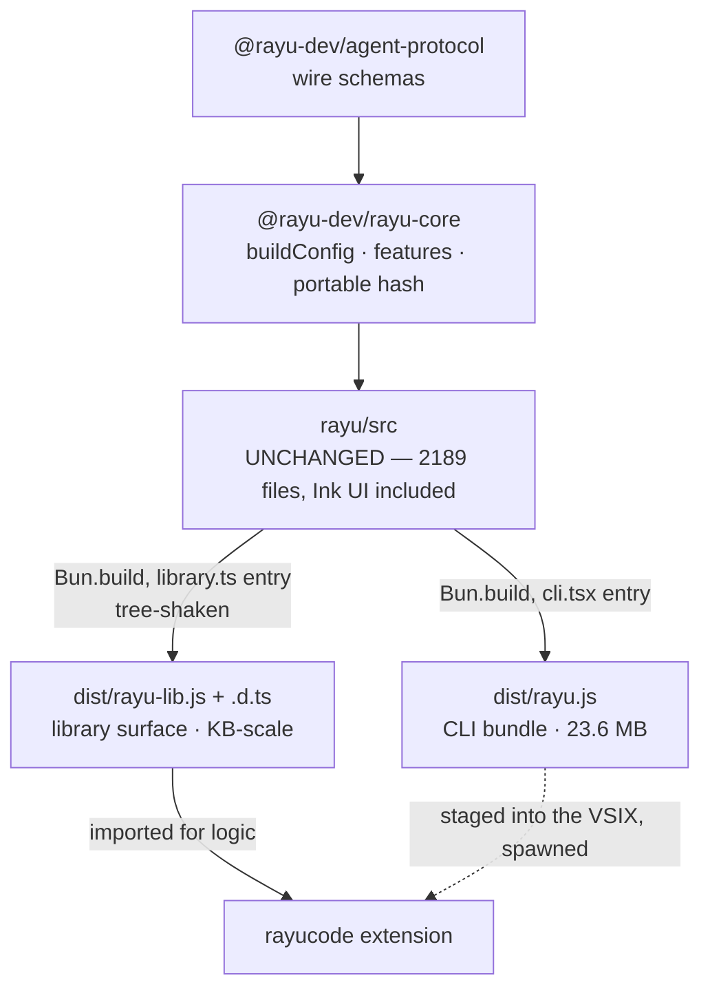

# Design: rayucode consumes `rayu/src` through a library bundle

Status: **proposed, empirically validated** · Alternative to Phase B of
[RAYU_CORE_MIGRATION_PLAN.md](./RAYU_CORE_MIGRATION_PLAN.md)

---

## 1. The question this answers

> Phase B is hard. Can we keep `rayu-cli` as it is and let `rayucode` import from
> `rayu/src`?

**Yes — and it is far cheaper than Phase B.** Not by importing `rayu/src`
directly, but by having `rayu` emit a **second bundle** alongside `dist/rayu.js`
that exposes a curated surface. No files move. `rayu/src` is not restructured.

---

## 2. Why Phase B is hard, restated precisely

Phase B assumed subsystems could be moved into a package in waves. The analyzer
(Task 1) measured why they cannot:

| Measure | Value |
|---------|-------|
| Largest strongly connected component in `src/` | **1618 files** (74%) |
| …containing | `screens/REPL.tsx` **and** `tools.ts`, `query.ts`, `commands.ts` |
| Files movable to core today | **303** of 2189 |
| Closure of `services/rayuAuth/rayuSession.ts` | **2037 files** |

Every Phase B target is mutually recursive with the React UI. Moving any of them
means breaking the cycle first, which is a redesign, not a move.

---

## 3. The insight

**A cycle blocks moving files. It does not block exposing a surface.**

Bun tree-shakes at the symbol level. Building from a narrow entrypoint discards
everything not reachable from the exported symbols, cycle or no cycle. Measured
with the real build configuration:

| Library surface | Bundle | React | JSX runtime |
|-----------------|--------|-------|-------------|
| auth (`rayuSession`: 5 exports) | **18 KB** | no | no |
| \+ `rayuConfig` providers | **431 KB** | no | no |
| \+ MCP config | 20 MB | no | **yes** |
| \+ command registry (`getCommands`) | 20 MB | no | **yes** |
| \+ context / `claudemd` | 20 MB | no | **yes** |

For reference, `dist/rayu.js` is **23.6 MB**. The auth surface is a **99.9%**
reduction — from a module whose import closure is 2037 files.

The 20 MB rows are not an artifact of `export *`; narrow named exports cost the
same, because those modules genuinely reach the UI at runtime.

**So the boundary is not "which files can move" but "which exports are cheap".**

---

## 4. Architecture



Two bundles from one source tree, sharing one configuration. The extension keeps
spawning `dist/rayu.js` for execution and additionally *imports*
`dist/rayu-lib.js` for logic it currently duplicates or fakes.

### What changes

| Component | Change |
|-----------|--------|
| `rayu/src` | **nothing** |
| `rayu/scripts/bundleConfig.ts` | **exists already** (extracted this session) |
| `rayu/src/entrypoints/library.ts` | new — the curated barrel, the only new source file |
| `rayu/scripts/build-lib.ts` | new — second `Bun.build` + `tsc --emitDeclarationOnly` |
| `rayu/package.json` | `exports` gains `"./lib"`; `files` gains the lib artifacts |
| `rayucode` | imports `rayu/lib`; deletes its duplicated readers |
| `WORKSPACE.md` §3 | narrowed: no importing `rayu/src` **directly**; the published lib surface is allowed |

### Why the shared config is mandatory

`rayu` is built from partial source: some `require()`d modules were never
present, and they only disappear because a `feature()` gate or a
`process.env.USER_TYPE` comparison folds to a constant. Measured — building a
second entrypoint with `define` missing only `process.env.USER_TYPE` fails with:

```
error: Could not resolve "./tools/REPLTool/REPLTool.js"
error: Could not resolve "./commands/agents-platform/index.js"
```

So the library build must reuse the CLI's exact `define` / `features` / stub /
external configuration. That is why `scripts/bundleConfig.ts` was extracted first
and `scripts/build.ts` now consumes it — verified byte-identical output
(24788992 both before and after).

---

## 5. Comparison

| | Phase B (extract into core) | This design (library bundle) |
|---|---|---|
| Files moved | ~1600, after breaking a 1618-file cycle | **0** |
| Risk to the CLI | high — every wave rewrites live code | **low** — one new entrypoint, existing bundle untouched |
| Cycle work required first | yes | **no** |
| Auth parity (Task 19) | after Tasks 6–7 | **immediately**, 18 KB |
| Commands / context / MCP | after the full cycle untangle | still needs the UI edges cut |
| Reversible | partially | **completely** — delete two files |

This design does **not** make the expensive surfaces cheap. It makes the cheap
ones available now, and turns "break a 1618-file cycle" from a prerequisite into
an optimisation that widens the surface later.

---

## 6. Tasks

### L1 — Shared bundle configuration · **DONE**

`scripts/bundleConfig.ts` owns `buildDefines()`, `STUB_ALIASES`, `EXTERNAL`,
`makeStubPlugin()`, `sharedBuildOptions()`. `scripts/build.ts` is now 22 lines.
`scripts/analyze-boundary.ts` imports the consts directly instead of parsing
build.ts's AST.

**Verified:** `dist/rayu.js` byte-identical at 24788992; `node dist/rayu.js
--version` → 1.6.23; typecheck 0 new errors; 59 tests green; boundary gate green.

### L2 — The library entrypoint

Create `src/entrypoints/library.ts`. Tier 1 only, because it is what measures
cheap and what the extension already duplicates:

```ts
export {
  getRayuApiBaseUrl, getRayuWebBaseUrl, getRayuGatewayBaseUrl,
  isUseRayuOAuthEnabled, readRayuSession, writeRayuSession,
  getValidRayuAccessToken, type RayuSessionStore, type RayuSessionUser,
} from '../services/rayuAuth/rayuSession.js'
```

**Tests.** A size budget (auth ≤ 64 KB) and a purity assertion (no `react`, no
`jsx-runtime`, no `bun:` specifier) over the emitted bundle. The budget is the
gate that stops the surface silently pulling in the UI — the analyzer's
`--cut-candidates` machinery already computes the same property for source.

### L3 — `scripts/build-lib.ts`

`Bun.build({ ...sharedBuildOptions(), entrypoints: ['src/entrypoints/library.ts'],
naming: 'rayu-lib.js' })`, then `tsc --emitDeclarationOnly` for
`dist/types/`. Declarations emit despite the 1557 accepted baseline errors —
verified; `tsc` only withholds emit under `noEmitOnError`.

**Tests.** `node -e "import('./dist/rayu-lib.js')"` under plain Node with no
`node_modules` reachable, mirroring the installed-CLI case.

### L4 — Publish the surface

`rayu/package.json`:

```json
"exports": { ".": "./dist/rayu.js", "./lib": { "types": "./dist/types/entrypoints/library.d.ts", "import": "./dist/rayu-lib.js" } },
"files": ["dist/rayu.js", "dist/rayu-lib.js", "dist/types", "README.md", "scripts/preinstall.cjs", "scripts/postinstall.cjs"]
```

**Invariant check.** The installer extracts only `dist/rayu.js`, so adding files
must not change that path — `npm run check:installer` still gates it. Still zero
runtime `dependencies`.

### L5 — Retire the extension's duplication (the plan's Task 19)

`rayucode/packages/vscode` takes `rayu` as a dependency and imports
`rayu/lib`. Delete the ~40 duplicated lines in `src/rayuSession.ts`; keep its
exported names so `rayuLogin.ts` and `webBridge.ts` are unchanged.

This also fixes a real divergence found during Task 15: the extension's
`rayuApiBaseUrl()` cannot see the CLI's baked `MACRO.RAYU_API_URL`, so a packaged
extension falls back to `localhost:4000` where the packaged CLI uses the baked
production host. Importing the library removes the second implementation and the
divergence with it.

**Tests.** Extension and CLI resolve identical endpoints for the same env; the
existing 18 sign-in tests keep passing unchanged.

### L6 — Widen the surface, gated by measurement

For each candidate export, run L2's budget test. If it fits, add it. If it drags
the UI in, the analyzer names the edges to cut
(`--cut-candidates`) — currently `commands.ts` (116 pure importers, **101 of them
type-only**), `entrypoints/agentSdkTypes.ts` (38/33 type-only),
`state/AppState.tsx` (32/32), `hooks/useCanUseTool.tsx` (17/17). Targets whose
edges are entirely type-only are cheapest: the type moves to a leaf module and
the runtime edge never existed.

Order by extension value: MCP config → context/`claudemd` → command registry.

---

## 7. Risks

| Risk | Mitigation |
|------|------------|
| Library surface silently pulls in the UI | L2 size budget + emitted-bundle purity test in CI |
| The two bundles drift in configuration | one `sharedBuildOptions()`; CLI output asserted byte-identical |
| Declarations reference the whole `src` tree | ship `dist/types/`; it is text, and the consumer is a `file:` dep |
| Extension bundle grows | measured: auth surface is 18 KB against a 5.2 MB VSIX |
| `files` change breaks the installer | `check:installer` already gates it; `dist/rayu.js` stays the extracted path |
| Duplicated readers diverge before L5 | L5 deletes one side; a parity test pins them until then |

---

## 8. What this does not solve

- **Tasks 7–12 as written remain out of reach** for commands, context, MCP and
  query. Their modules reach the UI at runtime, so no bundler trick helps; those
  edges have to be cut.
- **The extension still spawns the engine** for execution, deliberately: tools
  spawn processes and touch native deps, and running them in the extension host
  risks blocking the IDE.
- **`@rayu-dev/rayu-core` keeps its role** — build config, feature flags, portable
  hash — because it is what both the CLI *and* the library bundle depend on, and
  it is consumable by plain `npm install` (proven: 2 packages, no native binaries).

---

## 9. Recommendation

Adopt L1–L5 and treat Phase B (Tasks 6–12) as superseded for anything the
library surface can serve. Keep Task 5b (cycle-breaking) as the mechanism for
widening the surface in L6, driven by the ranked cut list rather than by a
file-move schedule.

The measured payoff: the extension gets the CLI's real auth implementation for
**18 KB** and zero moved files, where Phase B required breaking a 1618-file
cycle to reach the same place.
