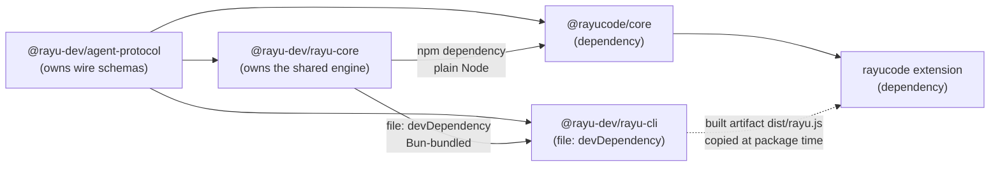

# Workspace & Package Ownership

Status: **decided** (Task 1). This document is the authority for package boundaries,
dependency direction, and build order. Later tasks implement what is written here.

## 1. The problem this structure solves

Before this refactor there were two independent package roots with independent
lockfiles and no shared contract:

| Root | Package manager | Lockfile |
|------|-----------------|----------|
| `rayu/` | Bun | `rayu/bun.lock` |
| `rayucode/` | npm | `rayucode/package-lock.json` |

The Rayu CLI's *typed* protocol surface (`rayu/src/entrypoints/sdk/controlTypes.ts`)
is entirely `any` — its own header records that the real definitions were absent
from the source it was reconstructed from. The real protocol is expressed only as
Zod schemas in `coreSchemas.ts` / `controlSchemas.ts`.

Because the extension could not import usable types, `rayucode/packages/core/src/protocol/`
was written as a **hand-made copy** of those schemas. Nothing verified the copy.
That is the structural cause of the protocol-drift bug class.

## 2. Package map (after this refactor)

```
rayu-cli/                          <- git root, npm workspace root
├── package.json                   <- npm workspace root (private, no version)
├── packages/
│   ├── agent-protocol/            <- @rayu-dev/agent-protocol
│   │                                 OWNS every wire schema + inferred type.
│   │                                 Deps: zod only. Build: tsc. No Bun, no MACRO.
│   └── rayu-core/                 <- NEW: @rayu-dev/rayu-core (npm workspace member)
│                                     OWNS the shared engine: build config,
│                                     portability, config, auth, tools, commands,
│                                     context, MCP, query. NO terminal UI.
│                                     Build: tsc. No react, no ink, no bun:*,
│                                     no unguarded Bun.*.
├── rayu/                          <- @rayu-dev/rayu-cli (NOT in the npm workspace)
│                                     Stays a standalone Bun project with bun.lock.
│                                     Ink/React terminal UI + entrypoints.
│                                     Consumes agent-protocol AND rayu-core as
│                                     file: devDependencies (Bun-bundled).
└── rayucode/
    └── packages/
        ├── core/                  <- @rayucode/core   (npm workspace member)
        └── vscode/                <- rayucode         (npm workspace member)
```

### Why `rayu-core` is a workspace member but `rayu/` is not

Same split as `agent-protocol`, for the same reason. `rayu-core` is a plain
`tsc`-built npm package that both sides resolve through `node_modules`, so it
belongs to the workspace. `rayu/` keeps Bun and stays out (below).

The CLI takes core as a **devDependency**, never a dependency: `@rayu-dev/rayu-cli`
must keep zero runtime dependencies, and Bun bundles core's source into
`dist/rayu.js` like any other import. The extension takes it as a real
**dependency**, because it runs under plain Node with no bundler — which is why
nothing in core may reach a Bun-only API unguarded. That boundary is enforced,
not merely documented: `rayu/scripts/analyze-boundary.ts` computes the import
closure and `cd rayu && bun run boundary` fails when it regresses.

### Why `rayu/` stays outside the npm workspace

`rayu/package.json` deliberately declares **no runtime dependencies** — a
documented invariant. `scripts/build.ts` inlines every import into the single
published `dist/rayu.js`, so nothing must be resolvable from `node_modules` at
runtime. Its ~100 build-time packages are resolved by Bun against `bun.lock`.

Folding it into an npm workspace would mean npm resolving that tree, which is
exactly the failure mode the invariant exists to prevent. It keeps Bun.

### Why `agent-protocol` lives at the git root, not under `rayu/` or `rayucode/`

It is consumed by **both** sides. Placing it under either root would make the
other side reach across a package boundary it does not own, and placing it under
`rayu/` would put a `tsc`-built npm package inside a Bun project.

## 3. Dependency direction (acyclic)



The critical rule: **`agent-protocol` depends on nothing in this repository.**
Its only dependency is `zod`. It therefore cannot participate in a cycle.

`rayu-core` depends only on `agent-protocol` (and `zod`, the same pinned exact
version). It must never import from `rayu/src` or `rayucode/`, which is what
keeps the graph acyclic as code migrates into it.

The previous design sketch had `rayu/src/entrypoints/sdk/controlTypes.ts`
importing from a *generated* `rayu/dist/` artifact that is itself built from
`rayu/src`. That is a build-order cycle and is rejected.

**Superseded by `rayu-core`:** `rayucode` previously could not import anything
from `rayu/src`, so `rayucode/packages/vscode/src/rayuSession.ts` duplicates ~40
lines of `rayu/src/services/rayuAuth/rayuSession.ts`. Shared engine code now has
a legitimate home — `rayu-core` — and the duplication is retired by importing
from there instead. The rule that stays is narrower and unchanged: `rayucode`
never imports `rayu/src` **directly**, and still consumes the built
`dist/rayu.js` as an opaque artifact copied into the VSIX at package time for
execution.

## 4. Ownership rule for types

> **One definition for data crossing stdin/stdout.** Not "no local types."

### `agent-protocol` owns (moved out of `rayu/src`)

| File | Origin |
|------|--------|
| `src/lazySchema.ts` | `rayu/src/utils/lazySchema.ts` |
| `src/coreSchemas.ts` | `rayu/src/entrypoints/sdk/coreSchemas.ts` |
| `src/controlSchemas.ts` | `rayu/src/entrypoints/sdk/controlSchemas.ts` |
| `src/index.ts` | new — public surface: schemas, inferred types, `PROTOCOL_VERSION` |

This is viable precisely because the import graph is shallow: `coreSchemas.ts`
imports only `zod/v4` and `lazySchema`; `controlSchemas.ts` imports only `zod/v4`,
`lazySchema`, and `coreSchemas`; `lazySchema.ts` has zero imports. There is no
Bun macro, no `MACRO.*`, and no internal Rayu coupling anywhere in that closure.

### `rayucode/packages/core` keeps (local domain — does NOT cross stdin/stdout)

- `session/state.ts`, `session/sessionStore.ts` — conversation items, render state
- `edit/proposalModel.ts`, `edit/applyEngine.ts`, `edit/contentHash.ts` — edit-review models
- `editor/adapter.ts` — the editor boundary interface
- `permission/coordinator.ts`, `permission/policy.ts` — local approval policy state
- `redaction/redactor.ts` — display-time redaction

### `rayucode/packages/vscode` keeps

- `webview/protocol.ts` — the **host ↔ webview** `postMessage` contract.
  This is a different boundary from stdin/stdout and stays local. Do not
  over-apply the ownership rule to it.

### Deleted (hand-copied wire contracts, replaced by the package)

- `rayucode/packages/core/src/protocol/messages.ts`
- `rayucode/packages/core/src/protocol/control.ts`
- `rayucode/packages/core/src/protocol/permissions.ts`
- `rayucode/packages/core/src/protocol/primitives.ts`
- `rayucode/packages/core/src/protocol/guards.ts` — delete if purely wire-shape
  guards; keep if it guards local concerns. Decided during Task 4.

`ndjson.ts` and `controlClient.ts` are **kept** — they are transport and
correlation logic, not contract definitions.

## 5. Module format

`agent-protocol` emits **ESM with declarations** (`"type": "module"`,
`declaration: true`). This matches every consumer:

| Consumer | Format | How it consumes |
|----------|--------|-----------------|
| `rayu` | ESM | Bun bundles it into `dist/rayu.js` |
| `@rayucode/core` | ESM | direct import |
| `rayucode` extension | CJS | esbuild converts ESM → CJS into `dist/extension.js` |

`zod` is pinned to `^4.4.3` to match `rayu`'s existing pin, and the schemas keep
importing the **`zod/v4` subpath** exactly as they do today. Both are required to
avoid a dual-Zod-instance problem, where `instanceof` checks and `safeParse`
results silently disagree across package boundaries.

## 6. Build order

`agent-protocol` must be built before anything that consumes it, because
consumers resolve it through `node_modules` to its `dist/`.

```
1. packages/agent-protocol   tsc            -> dist/index.js + dist/index.d.ts
2. packages/rayu-core        tsc            -> dist/index.js + dist/index.d.ts  (needs step 1)
3. rayu                      bun run build  -> dist/rayu.js            (needs steps 1, 2)
4. rayucode/packages/core    tsc            -> dist/                   (needs steps 1, 2)
5. rayucode/packages/vscode  esbuild        -> dist/extension.js, webview.js, webview.css
                             + copy rayu/dist/rayu.js
                             + generate dist/build-info.json           (needs steps 3, 4)
6. rayucode/packages/vscode  vsce package   -> rayucode-<version>.vsix
```

The root `package.json` exposes this as one ordered script. CI (Task 7) runs the
same ordering; it is not duplicated logic.

## 7. Versioning

Extension version is **not** forced to equal the CLI version. Each package
releases on its own cadence. Compatibility is asserted at runtime through
`dist/build-info.json`, whose schema and check semantics are defined in
[PROTOCOL.md](./PROTOCOL.md).

Forcing version equality would mean every CLI patch release requires an extension
release even when the protocol did not change, and would still not detect the case
that actually matters: an extension packaged against a *different* engine than the
one it ships.

## 8. Test layout (unchanged by this refactor)

| Suite | Runner | Location | Environment |
|-------|--------|----------|-------------|
| protocol unit | vitest | `packages/agent-protocol/test/**` | node |
| core unit | vitest | `rayucode/packages/core/{test,src}/**/*.test.ts` | node, no `vscode` |
| extension unit | vitest | `rayucode/packages/vscode/test/**`, `src/**/*.test.ts` | node, `vscode` aliased to `test/stubs/vscode.ts` |
| extension-host integration | `@vscode/test-cli` | `rayucode/packages/vscode/src/test/suite/*.integration.test.ts` | real VS Code |

The vitest config in `packages/vscode` excludes `src/test/**` so the integration
suite is driven only by `npm run test:integration`. That split is correct and stays.
