# 🏗️ Rayu CLI — Complete Software Architecture

Rayu CLI is a terminal-based, **bring-your-own-key** AI coding agent. It speaks to any
provider — Anthropic, OpenAI-compatible endpoints (NVIDIA, DeepSeek, Kimi/Moonshot,
OpenRouter, local servers…), AWS Bedrock, Google Vertex/Gemini, and Kiro/CodeWhisperer —
behind one unified agent loop, a full tool suite, MCP support, a skills system, a plugin
marketplace, and a multi-tier agent swarm.

This document is the single source of truth for how the codebase fits together. It is
organized top-down:

1. [🌍 Whole-System Architecture (Summary)](#-1-whole-system-architecture-summary)
2. [🤖 Agents, Subagents, Collaborator Swarm & Context](#-2-agents-subagents-collaborator-swarm--context)
3. [🛠️ Tool Use](#️-3-tool-use)
4. [⚙️ Background & Foreground Processes](#️-4-background--foreground-processes)
5. [🧪 Skills](#-5-skills)
6. [🔌 MCP (Model Context Protocol)](#-6-mcp-model-context-protocol)
7. [🧩 Plugins](#-7-plugins)
8. [📦 State](#-8-state)
9. [🔐 Auth](#-9-auth)
10. [🎛️ Configuration](#️-10-configuration)

> **Reading the diagrams:** every section opens with a Mermaid diagram for the mental
> model, then `
` blocks expand into the concrete files, types, and flows.

---

## 🌍 1. Whole-System Architecture (Summary)

At the highest level, Rayu CLI is a **single Bun/Node process** that boots through a
fast-path dispatcher, optionally mounts an interactive terminal UI (a custom React
renderer), and drives a streaming **agent loop** that calls a **provider router**. Tools,
skills, MCP servers, plugins, agents, and background tasks all hang off that loop.

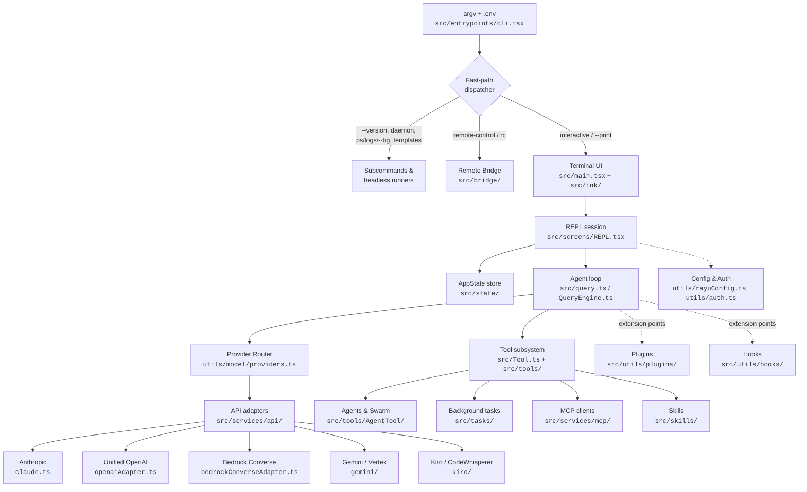

The runtime splits cleanly into four planes:

| Plane | Responsibility | Key locations |
|-------|----------------|---------------|
| **Boot / dispatch** | Parse argv, run a fast path or mount the UI | `src/entrypoints/cli.tsx` |
| **Presentation** | Terminal rendering, input, session screens | `src/main.tsx`, `src/ink/`, `src/screens/`, `src/components/` |
| **Orchestration** | Agent loop, tools, agents, tasks, hooks, compaction | `src/query.ts`, `src/QueryEngine.ts`, `src/tools/`, `src/services/` |
| **Provider / IO** | Model routing, API adapters, MCP, auth, config | `src/services/api/`, `src/services/mcp/`, `src/utils/` |

<b>🚀 Boot sequence & fast paths (<code>src/entrypoints/cli.tsx</code>)</b>

`main()` is optimized for startup latency: **every branch uses dynamic `import()`** so a
fast path pays for only the modules it touches. `feature(...)` is a build-time
dead-code-elimination gate (`bun:bundle`), so flags that don't apply to a build are
physically removed.

Order of operations:

1. `loadDotEnv()` — load `.env` **before any other module evaluates**.
2. Disable Corepack auto-pin; in remote/container mode raise `--max-old-space-size`.
3. Fast paths (each returns early):
   - `--version` / `-v` — prints `MACRO.VERSION (Rayu-CLI)` with **zero** further imports.
   - `--dump-system-prompt` — resolves the active model, renders and prints the system prompt.
   - `--computer-use-mcp` — runs the computer-use MCP server.
   - `--daemon-worker=<kind>` — lean worker spawned by the supervisor (no config/auth).
   - `remote-control` / `rc` / `remote` / `sync` / `bridge` — requires Anthropic OAuth +
     passes org **policy limits**, then enters `bridgeMain()`.
   - `daemon` — long-running supervisor.
   - `ps` / `logs` / `attach` / `kill` / `--bg` / `--background` — background **session
     registry** under `~/.rayu/sessions/` via `src/cli/bg.js`.
   - `new` / `list` / `reply` — template jobs.
   - `environment-runner`, `self-hosted-runner` — headless runners.
   - `--worktree --tmux` — re-exec into a tmux worktree.
4. Otherwise → capture piped stdin, load `src/main.tsx`, and start the interactive
   (or `--print` headless) session.

<b>🎨 Terminal UI — a custom React reconciler (<code>src/main.tsx</code>, <code>src/ink/</code>)</b>

The UI is **not** stock Ink. `src/ink/` is a vendored, heavily-optimized React reconciler
for the terminal: `reconciler.ts`, `renderer.ts`, `render-node-to-output.ts`, a layout
engine (`layout/`), selection/hit-testing, a line-width cache, terminal focus tracking,
and a keypress parser. `src/main.tsx` is the composition root that wires options,
pre-fetches settings/auth in parallel during module load, and mounts
`src/screens/REPL.tsx` — the live conversation surface. `src/components/` holds the
hundreds of TUI widgets (messages, pickers, dialogs, status line, diffs).

<b>🔁 The agent loop (<code>src/query.ts</code> + <code>src/QueryEngine.ts</code>)</b>

`query()` is an **async generator**: it streams an API turn, surfaces assistant/stream
events, then runs any requested tools and yields their results back into the next turn.
It owns the cross-cutting concerns of a turn:

- **Streaming tool execution** — `services/tools/toolOrchestration.ts` + `StreamingToolExecutor`.
- **Context management** — auto-compaction, reactive compaction, and context-collapse
  (`services/compact/`, `services/contextCollapse/`), plus tool-result budgeting.
- **Token budget** — `query/tokenBudget.ts` + `bootstrap/state.ts` track per-turn budget
  and continuation counts.
- **Hooks** — post-sampling hooks and stop / stop-failure hooks (`query/stopHooks.ts`).

`QueryEngine.ts` is the higher-level orchestrator that prepares config, system prompt, and
context, then consumes `query()`. The same `query()` generator powers the main loop,
subagents (via `runAgent.ts`), and forked side-queries (via `forkedAgent.ts`).

<b>🌐 Provider router & adapters (<code>utils/model/providers.ts</code>, <code>services/api/</code>)</b>

`getAPIProvider()` returns `anthropic | bedrock | vertex | foundry`. Environment flags
(`RAYU_USE_BEDROCK` / `RAYU_USE_VERTEX` / `RAYU_USE_FOUNDRY`) take precedence; otherwise it
reads the **active provider's `kind`** from `~/.rayu/providers.json`. Companion predicates
route the request to the right adapter: `isOpenAICompatibleActive()`,
`isVertexGeminiActive()`, `isRayuNonAnthropicActive()`.

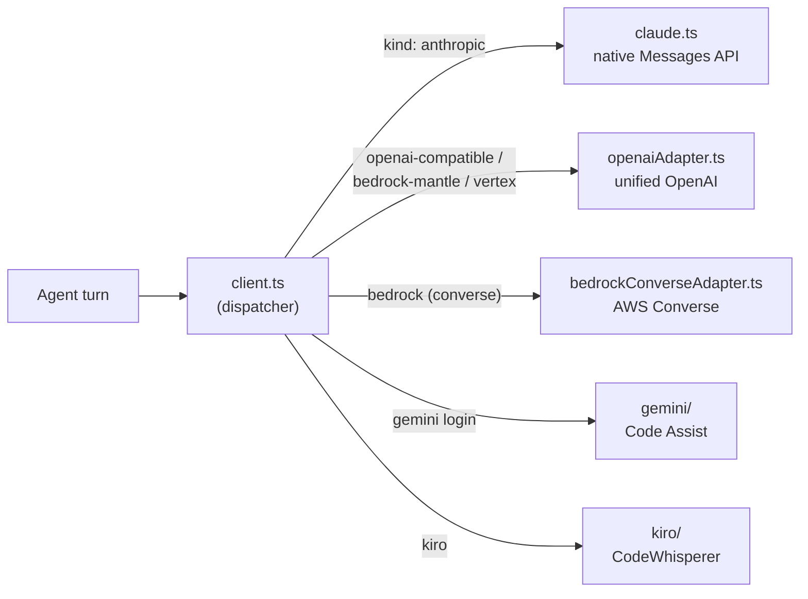

The **unified OpenAI adapter** is the workhorse: it serves plain OpenAI-compatible
endpoints, AWS Bedrock's `bedrock-mantle` OpenAI surface, and Vertex's
`…/endpoints/openapi` (with a Google OAuth bearer injected). `withRetry.ts` and `errors.ts`
provide retries, fallbacks, and normalized error handling across all adapters.

---

## 🤖 2. Agents, Subagents, Collaborator Swarm & Context

Rayu CLI runs a **three-tier agent model** on top of one process. The main agent can act
as a pure **orchestrator**, delegate domain work to semi-persistent **collaborators**, and
fan out atomic jobs to ephemeral **subagents** — all sharing a tiered, file-backed context
so nobody re-derives what's already decided.

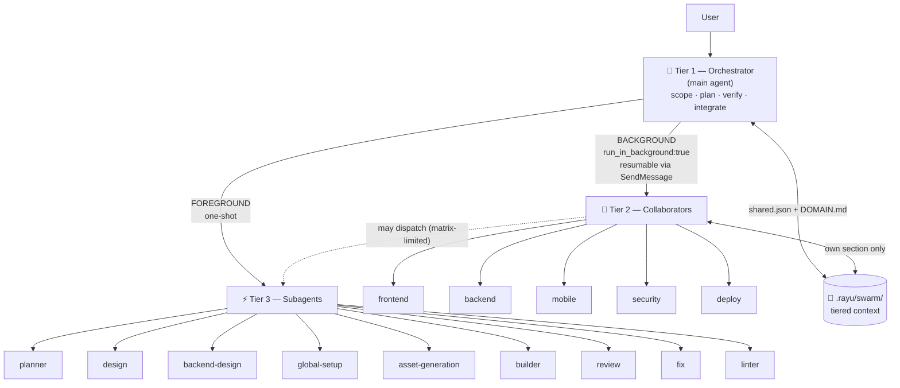

| Tier | Role | Lifetime | Execution | Examples |
|------|------|----------|-----------|----------|
| **1 — Orchestrator** | Plan, decompose, verify, integrate; never writes code in swarm mode | Whole session | Main thread | the main agent |
| **2 — Collaborators** | Semi-persistent domain implementers | Resumable | **Background**, named | `frontend`, `backend`, `mobile`, `security`, `deploy` |
| **3 — Subagents** | Atomic plan / generate / build / audit / fix jobs | One-shot | **Foreground** | `planner`, `design`, `backend-design`, `global-setup`, `asset-generation`, `builder`, `review`, `fix`, `linter`, plus `Explore`; `general-purpose` (non-web/mobile only) |

<b>📋 Built-in agent registry & gating (<code>tools/AgentTool/builtInAgents.ts</code>)</b>

`getBuiltInAgents()` assembles the available agents:

- Always: `GENERAL_PURPOSE_AGENT`, `STATUSLINE_SETUP_AGENT`.
- Non-SDK entrypoints: `RAYU_CODE_GUIDE_AGENT`, the **9 Tier-3 subagents**
  (`built-in/subagents/index.ts` → `SUBAGENTS[]`, incl. `planner` + `builder`), and the **5 Tier-2 collaborators**
  (`built-in/collaborators/index.ts` → `COLLABORATORS[]`).
- Gated: `EXPLORE_AGENT` (GrowthBook A/B), `VERIFICATION_AGENT` (feature + gate).
- **Coordinator mode** swaps the whole set for `getCoordinatorAgents()`.

Opt-outs: `CLAUDE_AGENT_SDK_DISABLE_BUILTIN_AGENTS` (SDK), `RAYU_DISABLE_SPECIALIST_AGENTS`
(disables the whole swarm: Tier-3 subagents + Tier-2 collaborators). Per-agent models via
`/model_subagent` and `/collaborator_model`. Parallel-builder cap per wave:
`RAYU_SWARM_MAX_PARALLEL` (default 5).

Swarm/teammate features are gated by `isAgentSwarmsEnabled()`: always on for
`USER_TYPE=ant`; otherwise requires `CLAUDE_CODE_EXPERIMENTAL_AGENT_TEAMS` (or
`--agent-teams`) **and** the GrowthBook killswitch.

<b>🧵 Subagent execution & forking (<code>tools/AgentTool/runAgent.ts</code>, <code>utils/forkedAgent.ts</code>)</b>

A subagent run (`runAgent.ts`):
1. `resolveAgentTools()` — compute the agent's allowed tool pool.
2. `initializeAgentMcpServers()` — connect any MCP servers declared in the agent's
   frontmatter (**additive** to the parent's clients, cleaned up on finish; skipped for
   user-defined agents under a plugin-only MCP policy).
3. `createSubagentContext()` — isolate mutable state so the child can't corrupt the parent.
4. `executeSubagentStartHooks()`, `getAgentModel()`, then drive `query()`.
5. Records a **sidechain transcript** (`recordSidechainTranscript`, `writeAgentMetadata`);
   on cleanup, `killShellTasksForAgent()` reaps the child's shell tasks.

**Forking for prompt-cache hits** (`forkedAgent.ts`): `CacheSafeParams`
(`systemPrompt`, `userContext`, `systemContext`, `toolUseContext`, `forkContextMessages`)
are shared verbatim with the parent so the API prompt cache is reused. `saveCacheSafeParams`/
`getLastCacheSafeParams` let post-turn forks (prompt suggestions, `/btw`) ride the main
loop's cache without threading params through.

<b>🪪 Agent identity context — why <code>AsyncLocalStorage</code> (<code>utils/agentContext.ts</code>)</b>

Because backgrounded agents run **concurrently in one process**, a single shared `AppState`
field would let Agent A's analytics/identity bleed into Agent B. So agent identity lives in
an `AsyncLocalStorage` store instead:

- `SubagentContext` — `{ agentType: 'subagent', agentId, subagentName, isBuiltIn, … }`
- `TeammateAgentContext` — `{ agentType: 'teammate', agentName, teamName, isTeamLead, … }`

`runWithAgentContext(ctx, fn)` scopes a run; `getAgentContext()` reads it. Cross-**process**
teammates (tmux/iTerm2 backends) instead use env vars `CLAUDE_CODE_AGENT_ID` and
`CLAUDE_CODE_PARENT_SESSION_ID`.

<b>📁 Tiered swarm context (<code>tools/AgentTool/swarmContext.ts</code>)</b>

Instead of the orchestrator hand-copying everything into every prompt, the swarm shares a
small, deterministic, **per-file** context under `.rayu/swarm/` (project-local):

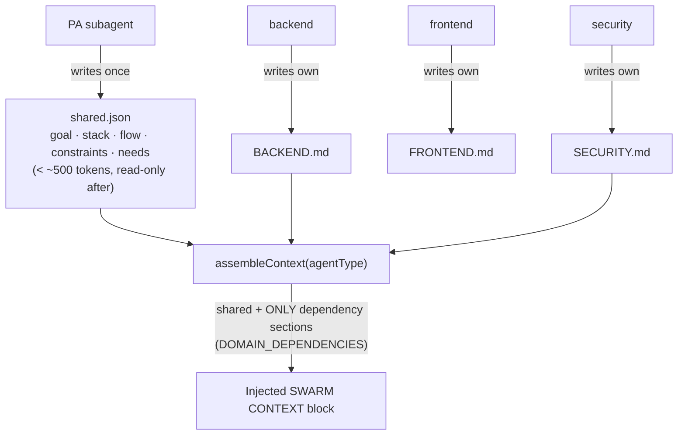

- **`shared.json`** — written once by `PA`; injected into every specialist.
- **`<DOMAIN>.md`** — one file per domain, written **only by its owner** (per-file
  ownership avoids the concurrent-write race a single shared file would have when a
  parallel wave runs).
- **`DOMAIN_DEPENDENCIES`** maps each agent to `['shared', …upstream sections]` (e.g.
  `frontend → shared, BACKEND, SECURITY`). Selection is **static** — zero latency, no
  embeddings; `ContextRetriever` is left as a seam for future RAG.
- **Token budget:** ~1500 tokens/section, ~6000 total (≈4 chars/token guardrail).

<b>🎚️ Swarm mode & the 3-phase flow (<code>utils/swarmMode.ts</code>, <code>commands/collaborator-swarm/</code>)</b>

`swarmMode` is a per-session `AppState` flag (reset on `/clear`). It is toggled on by
`/collaborator_swarm`, off by `/normal`, and **auto-enabled when a plan is approved**
(ExitPlanMode). When on, the main agent is re-framed each turn as the **orchestrator** and
runs the build flow:

1. **Scope & research** — clarify request + tech stack (with recommendations); `PA`
   researches open implementation choices.
2. **One aligned plan** — `PA` produces a single plan aligned across backend + frontend;
   user confirms.
3. **Build** — `global-setup` scaffolds, then a 3-way parallel design block
   (`design ∥ backend-design`), parallel implementation (`backend ∥ security`, then
   `frontend ∥ mobile`), a `review → fix` verification gate, and `deploy`.

A **subagent specialization matrix** (enforced in code, e.g. `COLLABORATOR_AGENT_TYPES`,
`SUBAGENT_TYPES`) restricts who may call what — e.g. `backend` may not call `design`;
`PA`/`global-setup` are orchestrator-only. The flow defaults to **parallel** dispatch.

<b>🛰️ Coordinator mode (<code>src/coordinator/coordinatorMode.ts</code>)</b>

A separate experimental orchestration mode: `isCoordinatorMode()` =
`feature('COORDINATOR_MODE')` + `CLAUDE_CODE_COORDINATOR_MODE`. The coordinator's system
prompt (`getCoordinatorSystemPrompt()` → *"You are RAYU, an AI assistant that orchestrates
software engineering tasks across multiple workers"*) confines it to `Agent`, `TaskStop`,
`SendMessage`, `SyntheticOutput` (`COORDINATOR_MODE_ALLOWED_TOOLS`). Workers spawned via the
Agent tool get `ASYNC_AGENT_ALLOWED_TOOLS`, plus a **scratchpad** directory for durable
cross-worker knowledge (gated by `tengu_scratch`).

---

## 🛠️ 3. Tool Use

Tools are the agent's hands. Every tool implements the `Tool` interface in `src/Tool.ts`;
the registry in `src/tools.ts` decides which tools exist for a given environment, mode, and
permission context, and assembles the final pool the model sees.

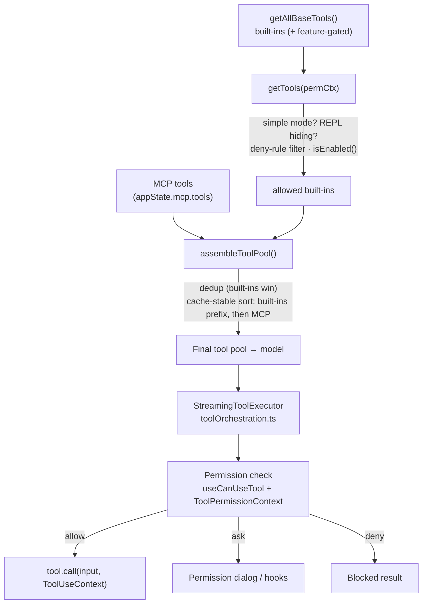

<b>🧰 The tool catalogue (<code>src/tools.ts</code>)</b>

Core built-ins (always present unless gated): `Agent`, `TaskOutput`, `Bash`, `Glob`,
`Grep`, `ExitPlanModeV2`, `FileRead`, `FileEdit`, `FileWrite`, `NotebookEdit`, `WebFetch`,
`TodoWrite`, `WebSearch`, `GenerateImage`, `GenerateVideo`, `TaskStop`, `AskUserQuestion`,
`Skill`, `InstallSkill`, `EnterPlanMode`, `SendMessage`, `Brief`, `ListMcpResources`,
`ReadMcpResource`, and `ToolSearch` (optimistically included).

Conditionally compiled via `feature(...)` / env gates: Task-V2 tools
(`TaskCreate/Get/Update/List`), `Team Create/Delete` (swarm), `EnterWorktree/ExitWorktree`,
`LSP`, `PowerShell`, `Workflow`, cron tools, `Monitor`, `RemoteTrigger`, `REPL`,
`Config`/`Tungsten` (ant), and various KAIROS tools. This keeps external builds lean while
ant builds get the full surface.

<b>🔗 <code>ToolUseContext</code> — what every tool receives (<code>src/Tool.ts</code>)</b>

`ToolUseContext` threads the session into each tool call:

- `options` — `commands`, `tools`, `mainLoopModel`, `thinkingConfig`, `mcpClients`,
  `mcpResources`, `agentDefinitions`, budget, custom/append system prompts, `refreshTools()`.
- `abortController`, `readFileState` (a size-limited file-state cache).
- `getAppState()` / `setAppState()`.
- `setAppStateForTasks?` — an **always-shared** setter for session-scoped infrastructure
  (background tasks, session hooks). Unlike `setAppState` (which is a **no-op for async
  agents**), this always reaches the root store so nested agents can register/clean up
  infrastructure that outlives a turn.
- `pendingFileChanges` channel — routes edits to the ROOT store so background agents editing
  the main tree still feed the `/undo` · `/keep` · review-card system.

<b>🔐 Permissions & per-agent tool scoping (<code>Tool.ts</code>, <code>constants/tools.ts</code>)</b>

`ToolPermissionContext` (deep-immutable) carries `mode`, `additionalWorkingDirectories`,
and `alwaysAllow / alwaysDeny / alwaysAsk` rule sets. `getTools()` strips blanket-denied
tools **before the model sees them** (so an `mcp__server` deny removes the whole server's
tools), and `useCanUseTool` enforces per-call decisions at runtime.

Agent classes get curated tool sets (`src/constants/tools.ts`):

| Set | Purpose |
|-----|---------|
| `ALL_AGENT_DISALLOWED_TOOLS` | Stripped from agents: `TaskOutput`, `ExitPlanModeV2`, `EnterPlanMode`, `Agent` (non-ant), `AskUserQuestion`, `TaskStop`, `Workflow` |
| `ASYNC_AGENT_ALLOWED_TOOLS` | Background/coordinator workers: `FileRead`, `WebSearch`, `TodoWrite`, `Grep`, `WebFetch`, `Glob`, shell, `FileEdit`, `FileWrite`, `NotebookEdit`, `Skill`, `SyntheticOutput`, `ToolSearch`, `EnterWorktree`, `ExitWorktree` |
| `IN_PROCESS_TEAMMATE_ALLOWED_TOOLS` | Teammates: `TaskCreate/Get/List/Update`, `SendMessage` (+ cron when enabled) |
| `COORDINATOR_MODE_ALLOWED_TOOLS` | Coordinator: `Agent`, `TaskStop`, `SendMessage`, `SyntheticOutput` |

`assembleToolPool()` deduplicates (built-ins win on name conflict) and sorts so built-ins
stay a contiguous prefix — required to keep the server-side **prompt cache** stable when
MCP tools change.

---

## ⚙️ 4. Background & Foreground Processes

Work runs **foreground** (inline in the conversation) or **background** (a tracked Task
whose output streams to disk while the user keeps working). Both shell commands and agents
can be backgrounded; an entire CLI session can also be detached.

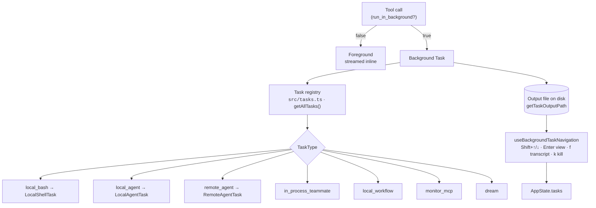

<b>📇 Task model & registry (<code>src/Task.ts</code>, <code>src/tasks.ts</code>)</b>

`TaskType` = `local_bash | local_agent | remote_agent | in_process_teammate |
local_workflow | monitor_mcp | dream`, each with an ID prefix (`b/a/r/t/w/m/d`) and a
collision-resistant random suffix. `TaskStateBase` tracks `status`
(`pending → running → completed | failed | killed`), `description`, `outputFile`,
`outputOffset`, and `notified`. `getAllTasks()` returns the concrete task classes
(`LocalShellTask`, `LocalAgentTask`, `RemoteAgentTask`, `DreamTask`, plus gated
`LocalWorkflowTask` / `MonitorMcpTask`); each exposes a `kill()`.

Task **output is streamed to a disk file**, not held in memory, so long-running output
doesn't bloat state and survives view-switching.

<b>🐚 Background shell & agents (<code>src/tasks/LocalShellTask/</code>)</b>

`run_in_background: true` on the Bash tool spawns a `LocalShellTask` instead of blocking the
turn; the agent reads progress later via `TaskOutput`. `killShellTasks.ts` reaps a child
agent's shell tasks on cleanup. Agents themselves can be backgrounded as collaborators
(the only resumable mode — they're addressed later by `SendMessage`), tracked alongside
`InProcessTeammateTask`.

<b>⌨️ Foreground navigation of background work (<code>hooks/useBackgroundTaskNavigation.ts</code>)</b>

`Shift+↑/↓` walks running teammates and background tasks; `Enter` enters an agent's view,
`f` opens its transcript, `k` kills it. When teammates exist the navigation steps through
leader→teammates; otherwise it opens the background-tasks dialog. Selection state
(`expandedView`, `selectedIPAgentIndex`, `viewSelectionMode`) lives in `AppState`.

<b>🧳 Detached CLI sessions (<code>src/cli/bg.js</code>, <code>~/.rayu/sessions/</code>)</b>

Beyond in-session tasks, an entire run can be detached with `--bg` / `--background`. The
fast-path subcommands manage a session registry under `~/.rayu/sessions/`:
`rayu ps` (list), `rayu logs <id>`, `rayu attach <id>`, `rayu kill <id>`.

---

## 🧪 5. Skills

Skills are reusable, model-invokable prompt packs (`SKILL.md` + optional reference files).
Rayu CLI sources them from three places: **bundled** (compiled into the binary),
**Rayu-native** (auto-loaded, shipped with the product), and **disk** (project/user/plugin).

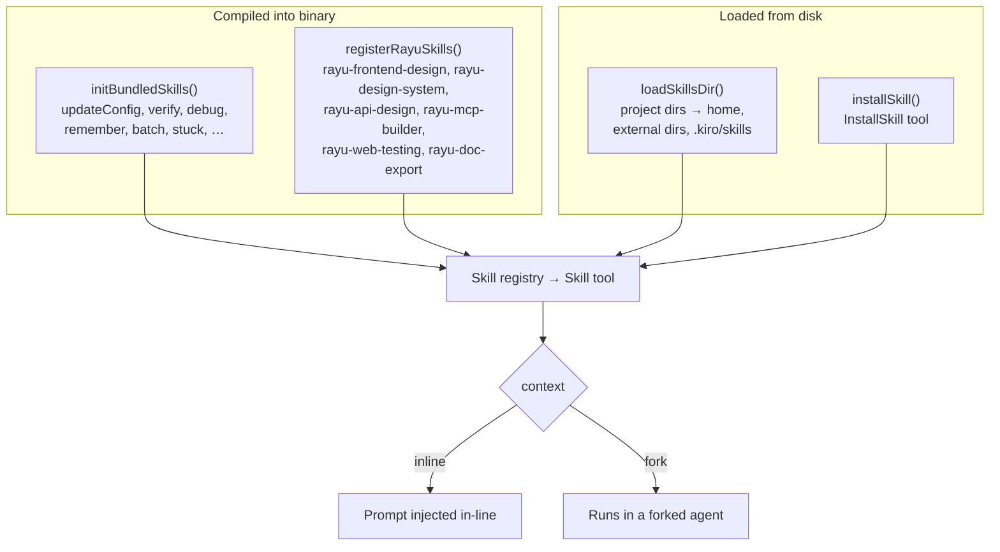

<b>📦 Bundled & Rayu-native skills (<code>src/skills/bundled/</code>)</b>

`initBundledSkills()` registers general skills (`updateConfig`, `keybindings`, `verify`,
`debug`, `loremIpsum`, `skillify`, `remember`, `simplify`, `batch`, `stuck`) plus
feature-gated ones (`dream`, `hunter`, `loop`, `scheduleRemoteAgents`, `claudeApi`,
`runSkillGenerator`).

`registerRayuSkills()` auto-loads the **6 Rayu-native skills** —
`rayu-frontend-design`, `rayu-design-system`, `rayu-web-testing`, `rayu-api-design`,
`rayu-mcp-builder`, `rayu-doc-export`. Each `SKILL.md` under `bundled/rayu/<name>/` is the
single source of truth, **inlined at build time** via Bun's `.md` text loader and mirrored
to the public skills repo by `scripts/sync-rayu-skills.ts`.

<b>🧬 Skill definition shape (<code>src/skills/bundledSkills.ts</code>)</b>

`BundledSkillDefinition` carries `name`, `description`, `whenToUse`, `allowedTools`,
`model`, `userInvocable`, `disableModelInvocation`, optional `hooks`, an `agent`
association, and `context: 'inline' | 'fork'`. A skill may ship `files` (relative-path →
content); on first invocation they're **extracted to disk once** and the prompt is prefixed
with a base directory so the model can `Read`/`Grep` them on demand — the same contract as
disk skills. `registerBundledSkill()` turns each into a `Command`.

<b>💽 Disk & MCP-backed skills (<code>loadSkillsDir.ts</code>, <code>installSkill.ts</code>, <code>mcpSkillBuilders.ts</code>)</b>

`loadSkillsDir.ts` discovers skills from project directories up to home, external skill
dirs, and `.kiro/skills` (e.g. `graphify`), parsing frontmatter for metadata.
`installSkill.ts` backs the `InstallSkill` tool. `registerMCPSkillBuilders()` lets MCP
servers contribute skill builders. Plugins can also contribute skills (see §7).

---

## 🔌 6. MCP (Model Context Protocol)

MCP lets Rayu CLI pull tools, resources, and prompts from external servers. Servers are
declared at several **scopes**, connected over multiple transports, and surfaced as tools
in the same pool as built-ins.

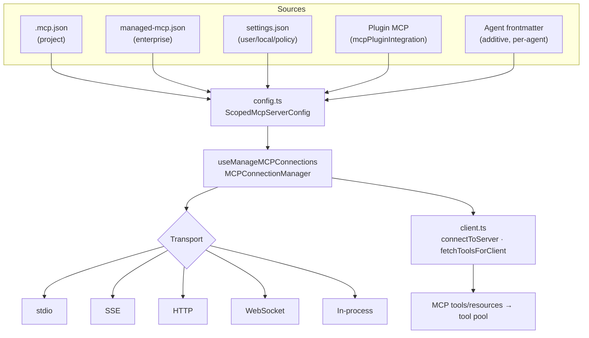

<b>🗂️ Config scopes & transports (<code>services/mcp/config.ts</code>, <code>types.ts</code>)</b>

`McpServerConfig` has `stdio`, `SSE`, `HTTP`, and `WebSocket` variants; `addScopeToServers`
wraps each with a `ConfigScope` to produce `ScopedMcpServerConfig`. Sources are merged:
project `.mcp.json` (at `getCwd()`), enterprise `managed-mcp.json`
(`getEnterpriseMcpFilePath()`), `settings.json` entries, plugin-provided servers, and
per-agent frontmatter servers. Environment variables in configs are expanded via
`expandEnvVarsInString`.

<b>🔌 Connection lifecycle & auth (<code>client.ts</code>, <code>useManageMCPConnections.ts</code>, <code>auth.ts</code>)</b>

`connectToServer` / `fetchToolsForClient` are memoized so repeated lookups reuse a live
client. `MCPConnectionManager` + `useManageMCPConnections` own connect/retry/teardown and
publish tools+resources into `AppState`. `services/mcp/auth.ts` handles OAuth against
servers that require it (with `oauthPort.ts` for the loopback), `elicitationHandler.ts`
handles server-initiated input requests, and `channelPermissions.ts` / `channelAllowlist.ts`
gate sensitive servers. `InProcessTransport` and `SdkControlTransport` support embedded and
SDK-driven servers.

---

## 🧩 7. Plugins

Plugins are the broadest extension unit: a single plugin can bundle commands, agents,
skills, output styles, hooks, MCP servers, and LSP servers. They come from a **built-in**
registry and from **marketplace repositories** (git-backed).

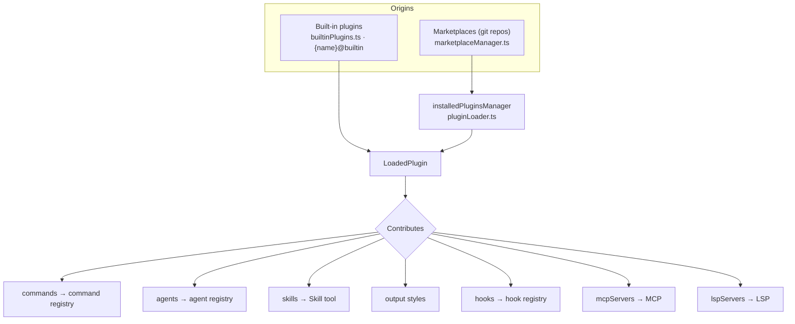

<b>📐 Plugin types (<code>src/types/plugin.ts</code>)</b>

- `BuiltinPluginDefinition` — `{ name, description, version?, skills?, hooks?, mcpServers?,
  isAvailable?(), defaultEnabled? }`. Registered via `registerBuiltinPlugin()`; appears in
  the `/plugin` UI as `{name}@builtin` and is enable/disable-able (persisted to settings).
- `LoadedPlugin` — the resolved plugin: `manifest`, `path`, `repository`, `enabled`, and
  the contributed surfaces (`commandsPath(s)`, `agentsPath(s)`, `skillsPath(s)`,
  `outputStylesPath(s)`, `hooksConfig`, `mcpServers`, `lspServers`).
- `PluginConfig` / `PluginRepository` — the registered marketplace repos (url + branch +
  pinned `commitSha`).

<b>🏪 Loading & marketplaces (<code>src/utils/plugins/</code>, <code>src/services/plugins/</code>)</b>

`marketplaceManager.ts` manages repositories (add/update/pin), `pluginLoader.ts` resolves
and caches plugins, and `installedPluginsManager.ts` tracks what's installed/enabled.
Per-surface loaders (`loadPluginCommands`, `loadPluginAgents`, `loadPluginHooks`,
`loadPluginOutputStyles`) plus `mcpPluginIntegration.ts` and `lspPluginIntegration.ts` wire
each contribution into the right subsystem. `validatePlugin.ts` + `schemas.ts` validate
manifests; `pluginPolicy.ts` / `pluginBlocklist.ts` and the **plugin-only policy**
(`strictPluginOnlyCustomization`) constrain what untrusted sources may add (e.g. locking
MCP to plugin-provided only).

---

## 📦 8. State

Session state is one large **deep-immutable `AppState`** object held in a tiny reactive
store and exposed to the React UI through context + selector hooks. Process-level facts
(session id, project root, token budget) live separately in bootstrap state.

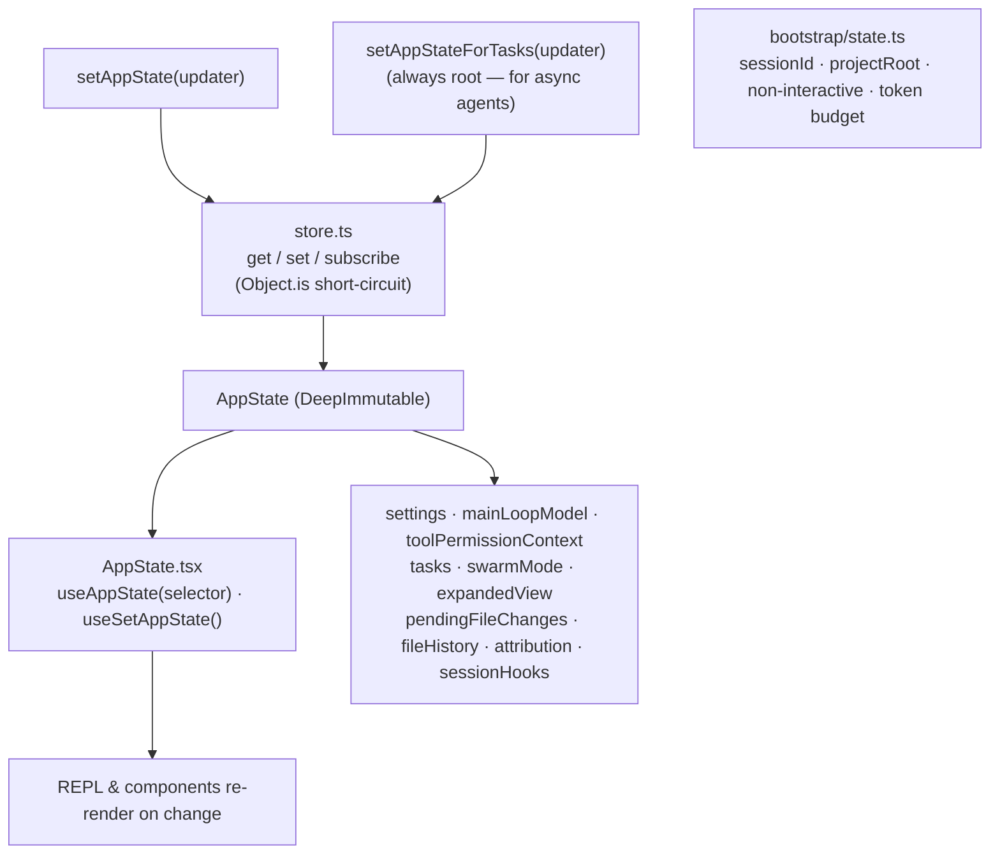

<b>🧱 The store & React binding (<code>src/state/</code>)</b>

`store.ts` is a minimal `get/set/subscribe` store; an updater that returns the previous
reference is short-circuited via `Object.is`, so no-op updates skip listener notification
(important under high-concurrency swarms). `AppState.tsx` provides the React context with
`useAppState(selector)` and `useSetAppState()`; `selectors.ts` and `onChangeAppState.ts`
add derived reads and change side-effects.

`AppState` (deep-immutable) holds, among many fields: `settings`, `verbose`,
`mainLoopModel`, `toolPermissionContext`, `tasks`, `expandedView`, `swarmMode`,
`kairosEnabled`, `coordinatorTaskIndex`, `viewSelectionMode`, `footerSelection`,
`pendingFileChanges`, `fileHistory`, `attribution`, and `sessionHooks`.

<b>🌐 Async-agent state semantics</b>

For backgrounded/async agents, `setAppState` is intentionally a **no-op** (a child must not
mutate the shared UI store). Session-scoped infrastructure that must survive (background
tasks, session hooks, pending file changes) is written through the **always-shared**
`setAppStateForTasks` / `pendingFileChanges` channels, which reach the **root** store
regardless of nesting depth. Process-level state lives in `bootstrap/state.ts`
(`getSessionId`, `getProjectRoot`, non-interactive detection, token-budget accounting).

---

## 🔐 9. Auth

Auth is **provider-shaped**: the active provider's `kind` decides which credential path is
used. Anthropic-specific auth is automatically disabled when a non-Anthropic provider is
active. Secrets are read from secure OS storage, file descriptors, env, or OAuth flows —
never logged.

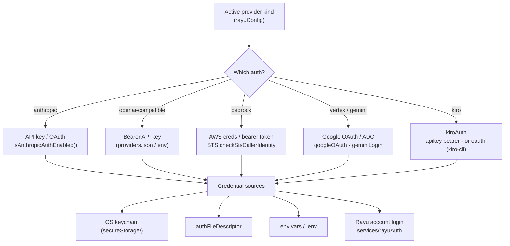

<b>🗝️ Provider auth resolution (<code>src/utils/auth.ts</code>)</b>

`isAnthropicAuthEnabled()` returns **false** when `getActiveProvider().kind !== 'anthropic'`,
so third-party providers don't trigger Anthropic key prompts or Anthropic-only network calls
(policy limits, remote settings — gated by `isRayuNonAnthropicActive()`). Keys come from
`getRayuApiKey()` (config) or env. `isManagedOAuthContext()` (`RAYU_REMOTE` /
`rayu-desktop`) prevents managed sessions from falling back to the user's terminal API key.

<b>🔏 Credential storage & cloud identities (<code>secureStorage/</code>, <code>aws.ts</code>, <code>services/oauth/</code>)</b>

- **Secure storage** — OS keychain via `secureStorage/` (`macOsKeychainHelpers`), with a
  prefetch cache; `authFileDescriptor.ts` reads keys/tokens passed via FD for managed runs.
- **AWS** — `checkStsCallerIdentity()` validates Bedrock credentials; `AwsAuthStatusManager`
  tracks status. Bedrock can also use the `AWS_BEARER_TOKEN_BEDROCK` bearer token.
- **Google** — `services/oauth/googleOAuth.ts` (Vertex, cloud-platform scope) and
  `geminiLogin.ts` (free interactive Gemini Code Assist sign-in) with an
  `auth-code-listener` loopback.
- **Anthropic OAuth** — `services/oauth/` console flow, primarily for the remote bridge.
- **Kiro** — `services/api/kiro/kiroAuth.ts`: either the `ksk_` key as a bearer + a
  `TokenType: API_KEY` header, or an OAuth token read/refreshed from `kiro-cli`'s sqlite.
- **Rayu account** — `services/rayuAuth/` (`rayuLogin`, `rayuSession`) for product login.

API keys live in a `0600` `providers.json` and are referenced by id, never echoed.

---

## 🎛️ 10. Configuration

Configuration is layered: provider/key config in `~/.rayu/providers.json`, layered
`settings.json` (user → project → local → enterprise/policy), MCP config files, environment
variables, and **build-time feature flags** + runtime GrowthBook gates.

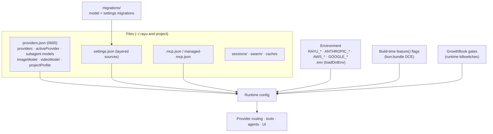

<b>🧾 Provider config (<code>src/utils/rayuConfig.ts</code>, <code>rayuProviders.ts</code>)</b>

`RayuConfig` (in `~/.rayu/providers.json`, `0600`):
`activeProvider`, `providers[]`, `subagent { providerId, model }`,
`subagentByAgent` (per-specialist overrides), `imageModel`, `videoModel`, `projectProfile`.

`RayuProvider.kind` ∈ `anthropic | openai-compatible | bedrock | vertex | genai | kiro`,
with per-kind fields: `apiKey`/`baseURL`/`defaultModel`/`smallFastModel`/`contextWindow`/
`models`/`fetchedModels`; OpenAI feature modes (`promptCacheKey`, `reasoningEffort`,
`streamOptions`); Bedrock `bedrockApi` (`openai | anthropic | converse`) + AWS creds/region;
Vertex `gcpProject`/`gcpRegion`; Kiro `kiroAuthType` (`apikey | oauth`).

`rayuProviders.ts` holds the `ProviderPreset` registry used by onboarding and `/connect`,
computes the Bedrock `bedrock-mantle` base URL and the Vertex `…/endpoints/openapi` URL, and
**imports keys from known env vars / `.env`** into `providers.json` so existing keys become
first-class entries.

<b>⚙️ Settings, env & feature gating (<code>utils/config.ts</code>, <code>utils/settings/</code>, <code>bun:bundle</code>)</b>

- **`settings.json`** is layered across sources (user / project / local / enterprise-policy)
  via `utils/settings/`; `getSettingsForSource` and source-enable checks resolve precedence,
  and the plugin-only policy can lock customization surfaces.
- **Environment** — `.env` is loaded first; `RAYU_*` flags (e.g. `RAYU_USE_BEDROCK`,
  `RAYU_OPENAI_COMPATIBLE`, `RAYU_OPENAI_BASE_URL`, `RAYU_REMOTE`) plus cloud-native vars
  (`ANTHROPIC_*`, `AWS_*`, `GOOGLE_*`) influence routing and auth.
- **`feature(flag)`** — a `bun:bundle` macro evaluated at build time for **dead-code
  elimination**, so a build only contains the features it ships; **GrowthBook** gates
  (`getFeatureValue_CACHED_MAY_BE_STALE`, `checkStatsigFeatureGate_*`) provide runtime
  killswitches/experiments on top.
- **Migrations** — `src/migrations/` upgrades model names and settings shapes across
  versions so configs survive updates.

<b>🪝 Hooks & extension points (<code>src/utils/hooks/</code>)</b>

Lifecycle hook events (`entrypoints/sdk/coreTypes.ts → HOOK_EVENTS`): `PreToolUse`,
`PostToolUse`, `PostToolUseFailure`, `Notification`, `UserPromptSubmit`, `SessionStart`,
`SessionEnd`, `Stop`, `StopFailure`, `SubagentStart`, `SubagentStop`, `PreCompact`,
`PostCompact`, `PermissionRequest`, `PermissionDenied`, `Setup`, `TeammateIdle`,
`TaskCreated`, `TaskCompleted`, `Elicitation`, `ElicitationResult`, `ConfigChange`.

Hooks come from `settings.json`, plugins (`loadPluginHooks`), agent/skill frontmatter
(`registerFrontmatterHooks`), and ephemeral in-session **function hooks**
(`utils/hooks/sessionHooks.ts` — a `FunctionHook` callback returns `false` to block an
action). They're stored per-agent in a `Map` so registering/removing one doesn't churn the
whole store.

---

### 📎 Appendix — Subsystem-to-source map

| Subsystem | Primary locations |
|-----------|-------------------|
| Bootstrap / dispatch | `src/entrypoints/cli.tsx`, `src/main.tsx` |
| Terminal UI | `src/ink/`, `src/screens/REPL.tsx`, `src/components/` |
| Agent loop | `src/query.ts`, `src/QueryEngine.ts`, `src/query/` |
| Provider routing & adapters | `src/utils/model/`, `src/services/api/` (`claude.ts`, `openaiAdapter.ts`, `bedrockConverseAdapter.ts`, `gemini/`, `kiro/`) |
| Agents / swarm / coordinator | `src/tools/AgentTool/`, `src/utils/swarm/`, `src/coordinator/`, `src/utils/agentContext.ts`, `src/utils/forkedAgent.ts` |
| Tools | `src/Tool.ts`, `src/tools.ts`, `src/tools/`, `src/constants/tools.ts` |
| Tasks (bg/fg) | `src/Task.ts`, `src/tasks.ts`, `src/tasks/`, `src/cli/bg.js`, `src/hooks/useBackgroundTaskNavigation.ts` |
| Skills | `src/skills/`, `src/skills/bundled/`, `src/utils/skills/` |
| MCP | `src/services/mcp/`, `src/commands/mcp/`, `src/utils/mcp/` |
| Plugins | `src/plugins/`, `src/utils/plugins/`, `src/services/plugins/`, `src/types/plugin.ts` |
| State | `src/state/`, `src/bootstrap/state.ts` |
| Auth | `src/utils/auth.ts`, `src/services/oauth/`, `src/services/rayuAuth/`, `src/services/api/kiro/kiroAuth.ts`, `src/utils/secureStorage/` |
| Configuration | `src/utils/rayuConfig.ts`, `src/utils/rayuProviders.ts`, `src/utils/config.ts`, `src/utils/settings/`, `src/migrations/` |
| Hooks | `src/utils/hooks/`, `src/entrypoints/sdk/coreTypes.ts` |

*This guide reflects the Rayu CLI source as read from `src/`. Feature-gated subsystems
(coordinator mode, KAIROS, workflows, agent triggers, verification agent) are present in the
codebase but only active under their respective `feature()` builds and runtime gates.*
